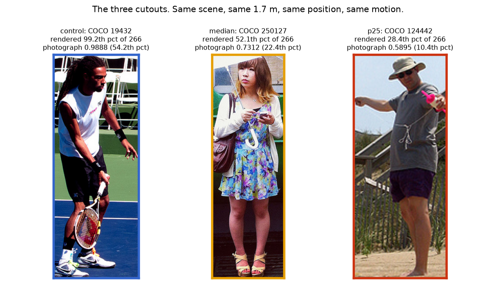
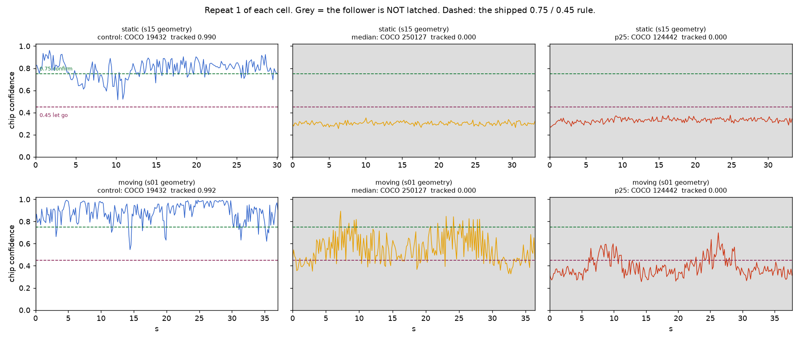

# What does the drone do with a TYPICAL person? Flying the person cells with a median and a 25th-percentile cutout

Session 2026-09-15, repo `pytorch_ssd` at `6ed75e1` (clean at launch and at the
end). **Simulation only - no hardware, no GAP8, no firmware.** The "chip"
network is `model_id_dory.onnx` under the repo's own `ChipPerception`, the
camera is `camera_model.himax_typical`, and every flight is CrazySim headless on
the matte floor. 18 scored flights (19 attempted, one re-flown), 03:51:50Z to 04:13:34Z,
21 minutes, every one behind the shared simulator lock.

**Nothing under `tools/` was edited.** The only additions there are four new
`scene_defs/*.json`; the five tool hashes are pinned before and after and are
identical (§7). Nothing was committed or pushed. No existing scene definition
was touched, and `docs/sim_results/` and every earlier `docs/eval_results/`
directory is untouched.

---

## 0. The question this answers, and the one it does not

`docs/eval_results/2026-09-15-sim-person-fidelity/` established that the cutout
**both** flown person cells are built from - COCO val2017 image 19432,
annotation 428692 - renders at the **98.5th-100th percentile** of detectability
among 266 real people put through the simulator's own cutout pipeline, while
being an ordinary **43.8th-54.2nd percentile** photograph. Every published
person tracking fraction (0.97-0.99) is therefore a measurement of an unusually
easy card. That study is static frames only, and it says so explicitly: per-frame
rates cannot be multiplied into a loss-of-track fraction, because consecutive
video frames are strongly correlated and the follower has hysteresis (a 3-frame
confirmation at 0.75 to latch, a drop below 0.45 to let go).

**This directory closes that gap by flying it.** Same scenes, same geometry, same
motion, same lighting, same matte floor, same truth, same shipped 0.75/0.45/3
rule, same ships-as setup - only the person on the panel changes.

---

## 1. Picking the two people, from the distribution rather than from an opinion

Nothing was re-scored. `scripts/pick_subjects.py` reads the fidelity study's own
`tables/sim_cohort.csv` and `tables/real_people.csv` and ranks them with the same
aggregation `subject_selection.py` used to place the flown cutout: **chip arm,
himax camera, dy = 0, one number per subject per range (the mean over that
subject's himax draws)**. The shared scorer
(`champion_arms.py`, sha256 `78946a3f...`) is recorded but never invoked - these
are the study's own numbers, read as written.

**The index.** `subject_selection.py` reports a percentile per range. This
directory pools those six percentiles by their **mean**, over the flown ladder
1.5 / 2.0 / 2.5 / 3.0 / 3.5 / 4.0 m. It is deliberately rank-based: the cohort's
own median confidence swings from 0.430 at 2.5 m to 0.769 at 1.5 m, so averaging
raw confidences would silently weight the ranges with the widest spread. Both
indices were computed and they agree on both picks (`pct_cohort_confmean` in
`tables/subject_picks.tsv`).

Re-derived here, the flown cutout sits at the **99.2nd** percentile of 266 peers
on this index (per range 100 / 100 / 100 / 98 / 98 / 99, which is the fidelity
study's own table to the digit).

**Eligibility, in two stages, both published in full
(`tables/cohort_ranking.tsv`).**

*Mechanical*, from the fidelity study's own columns: `wui == 1` (whole, upright
and unoccluded by COCO's own keypoint visibility flags, untruncated, wholly
inside the centre crop in both axes, **and** isolated - exactly one non-crowd
person and no crowd region); source crop at least 200 px tall, so the panel is
not upsampled further than the flown cutout's own 404 px; implied panel width
0.35-0.85 m at 1.7 m tall. That takes the 59 `wui` peers to **39**.

*By eye*, and this stage is not optional. The fidelity study made the same
correction for the same reason ("one correction to this directory's own
inclusion rule, found by looking at the pictures"). Among the 39, COCO **340451
is a person sitting on a bench** (knees bent; aspect still 2.14, so the
mechanical rule admits it) and COCO **398237, 50638, 442306, 7088, 139077 and
456662 are small children**, for whom the scenes' 1.7 m is not a plausible
height. The screen requires an **adult, standing on their own feet in a neutral
upright stance, nothing in front of them**, which is what the flown cutout is -
holding that fixed is what makes "only the person changed" true. **12 of the 39
survive**; every rejection is listed with its reason in `tables/subject_picks.txt`
and `tables/cohort_ranking.tsv`.

Then: the survivor nearest the 50th percentile, and the survivor nearest the
25th. No further filtering.

### The two picks, and why neither is a cherry-picked failure

| | flown cutout (CONTROL) | MEDIAN pick | ~25th-PERCENTILE pick |
|---|---|---|---|
| COCO image / annotation | 19432 / 428692 | **250127 / 184031** | **124442 / 1238296** |
| what it is | adult standing, tennis court | adult woman standing, facing the camera | adult man standing on a beach path |
| **rendered index, of 266 peers** | **99.2nd** | **52.1st** | **28.4th** |
| per-range percentile (1.5/2/2.5/3/3.5/4 m) | 100/100/100/98/98/99 | 44/69/35/76/49/39 | 71/52/20/21/0/6 |
| rendered chip/himax confidence, same ranges | .998/.997/.979/.943/.972/.980 | .720/.768/.336/.694/.612/.530 | .888/.652/.254/.354/.241/.329 |
| **its own photograph**, chip, resolution-matched | 0.989 | 0.731 | 0.590 |
| that photograph's percentile among size-matched whole-upright photographs | 54.2nd (n=48) | 22.4th (n=58) | 10.4th (n=48) |
| source crop | 154 x 404 px | 137 x 423 px | 90 x 214 px |
| aspect h/w -> panel width at 1.7 m (from the built manifest) | 2.63 -> **0.6475 m** | 3.10 -> **0.5479 m** | 2.39 -> **0.7139 m** |
| person annotations in the image | 1 | 1 | 1 |

**Physical height.** Both picks are adults standing upright, so the scenes'
`height_m` stays at **1.7** for all three - the number is not touched, and with
it the apparent size law `px128_h = 155.4 / range_m` and the whole hold-band
geometry are unchanged. The panel's **width** does change, because it is
`height_m x bbox_w/bbox_h` and a different photograph is a different shape; that
is what "a different person" means, and it is the only geometric consequence
(§2 proves it is the only one).

**Why these are fair picks.**

* They are the *nearest survivors to 50 and to 25* under a rule fixed before the
  picks were read off, not subjects chosen for their behaviour. The full ranked
  list of all 267 rendered subjects, with eligibility and the by-eye verdict, is
  in `tables/cohort_ranking.tsv`.
* Both are ordinary *photographs*, not broken ones: 0.731 and 0.590 on the chip
  arm. Neither is one of the cohort's genuinely hard cases (the cohort's bottom
  tail runs to 0.191 and 0.228).
* Both indices (rank-pooled and raw-confidence-pooled) put them at 52.1/52.6 and
  28.4/25.2.

**Three honest weaknesses in the picks, stated up front.**

1. **The 25th-percentile pick is not uniform across range.** Its per-range
   percentiles run 71 / 52 / 20 / 21 / 0 / 6: at 3.5 m it is the *lowest of 266*.
   The runner-up (COCO 527750, index 34.3) has a flatter profile. Nothing was
   re-picked to avoid this, but any reading of the 25th-percentile cell has to
   carry it.
2. **A median *rendered* person is not a median *real* person.** The fidelity
   study measured the renderer compressing the confidence scale toward ~0.6, so
   the rendered cohort is *harder* than the same people's own photographs
   (below-exit **0.397 rendered against 0.113 photographed**, both sides on the
   himax chain - see the correction in §6). Ranking by rendered detectability is
   the right choice for a simulator experiment - it is what the flight will
   actually see - but it means these cells bracket the real answer from the
   pessimistic side. §6 says exactly what that does and does not permit.
3. **The two picks are not a monotone difficulty ladder, and the labels do not
   survive the flight.** *Added 2026-09-15 by an independent audit; see
   `tables/audit_independent.txt` §4a.* The cohort index ranks subjects over six
   **static, on-axis** renders. The static flight sits at 3.64 m on a 15.9 deg
   bearing with sensor noise, and the ranking does not survive that: in
   `A.static` the *25th-percentile* subject returns a **higher** in-flight
   confidence (median 0.334) than the *median* subject (0.312), reversing the
   cohort order, which at 3.5 m puts them at 0.241 and 0.612. The same inversion
   is already visible in this directory's own build-time probe (§4.5) and was
   not called out there. Read the two cells as **two samples of a typical
   person**, not as a graded pair; **no claim in this directory should rest on a
   median-vs-p25 difference.** The verdict is unaffected - both are 0.000, and
   both sit far below the entry bar on every flight.

---

## 2. The new scenes, and the proof that only the person changed

Four new definitions, generated from the originals by
`scripts/make_scene_defs.py`, which loads each original and edits only the
`scene_id`, the free text, and `subjects[0].coco`:

| new scene | from | subject |
|---|---|---|
| `tp15_static_median` | `s15_static_offset` | COCO 250127 |
| `tp15_static_p25` | `s15_static_offset` | COCO 124442 |
| `tp01_moving_median` | `s01_control_moving` | COCO 250127 |
| `tp01_moving_p25` | `s01_control_moving` | COCO 124442 |

The names cannot be confused with the originals (`tp` = typical person), and
`run_acceptance2.sh` does not reference them, so the acceptance matrix is
unchanged. **All 18 pre-existing `scene_defs/*.json` hash identically before and
after** (`scene_hashes_before.txt` vs `scene_hashes_after.txt`).

**The scenes were built into scratch, not into `tools/crazysim_macos/scenes_v2/`,
and the builder is deterministic.** Rebuilding the two ORIGINALS into the same
scratch directory with the same `build_scene.py` reproduces the published
artefacts **byte for byte**:

```
s15_static_offset  scene.xml  8e597e6a...  scratch == scenes_v2   SAME
s01_control_moving scene.xml  ad1caece...  scratch == scenes_v2   SAME
subj_person_target.png / subj_person.png                          SAME
```

so the control cells below flew exactly the scene the published baseline flew.

**The equivalence check** (`scripts/verify_scene_equivalence.py`,
`tables/scene_equivalence.txt`) compares the BUILT artefacts, not the
definitions. Per pair it walks all **99 manifest keys** and classifies every
difference, then diffs `scene.xml` line by line with the scene id and the
texture filename masked. Result for all four pairs:

* **UNEXPECTED differences: none.** The 16 differing manifest keys are the COCO
  source (img/ann/file_name/bbox), the scene id, four free-text fields, the
  builder's own `scene_def`/hashes, and three quantities `build_scene` *derives
  from the cutout's own bbox*: `panel.width_m`, `panel.aspect`,
  `background.subject_fraction`.
* **Asserted equal and printed:** `room.floor_reflectance` 0.0 (matte),
  `room.flight_height_m` 0.8, `room.wall_rgb` [158,158,168], `room.drone_start`
  [0,0], `lighting.variant` default with headlight 0.6/0.5, `camera.fovy_deg`
  70.0 and `focal_px` 174.23, `subjects[0].name`, `role`, `panel.height_m` 1.7,
  `panel.z_center_m` 0.85, `panel.euler` "0 0 0", the whole `motion` block
  (type/p0/law/mechanism), `truth.body`, `expected_behaviour.target` and
  `verdict`, `scripted_motion.env`, and **all 15 fields of
  `expected_behaviour.gates`**.
* **`scene.xml`: exactly one line differs, and it is the panel's half-WIDTH.**

```
- <geom name="subj_person_target_panel" ... size="0.004 0.3237 0.8500" euler="0 0 0" ...>
+ <geom name="subj_person_target_panel" ... size="0.004 0.2739 0.8500" euler="0 0 0" ...>
```

  Half-height 0.8500, thickness 0.004, euler, body `pos`, body name,
  contype/conaffinity, the room, the walls, the floor material and its
  reflectance, both lights and (for the moving pair) the spring joint are
  identical. The half-width is `height_m/2 x bbox_w/bbox_h` - the same quantity
  the manifest reports as DERIVED.

---

## 3. How it was flown

`scripts/fly_typical.sh`. `run_acceptance2.sh` could not be used directly: its
CORE matrix is hard-coded and `--only` is a filter on that matrix, so it has no
way to name a scene it does not list, and `tools/` is not edited here. The
runner's `fly()` is a faithful copy of the harness's own - same
`$SCRATCH/sim.lock` protocol (taken before every flight, dropped after, released
on every exit path including Ctrl-C), same `run_sim_headless.sh --camera
--scene`, same "firmware connected" wait, same `CRAZYSIM_TRUTH_LOG` /
`_TRUTH_PREFIX` / `_SCENE_MOTION` / `_SENSOR_PRESET` / `_SENSOR_SEED` /
`_SENSOR_INFO` environment, same `cell.json` keys, same `perl alarm` wrapper,
same teardown, same `scoreboard.py --check-run` validity gate with one re-fly on
INVALID.

**Setup: ships-as on every cell** - chip backend, `himax_typical` camera,
6.5 Hz / 153 ms - because the question is what the real drone does. Durations are
the matrix's own: 45 s static, 50 s moving. Sensor seed is the harness's own
`1000 + repeat`, so the three subjects of a repeat see the *same* sensor draw.

**No threshold flag is passed anywhere.** The follower's command line is
`--duration D --out RUN --backend chip --rate-hz 6.5 --latency-ms 153`, so
`--vis-enter 0.75`, `--vis-exit 0.45` and `--confirm-frames 3` are the shipped
defaults, and each flight writes what it actually flew into its own
`summary.json`.

**The camera is the same object on every flight.** Each run writes its own
`camera_model.json`; all 18 record `preset himax_typical` with an identical
parameter block, and repeat N always uses seed `1000 + N`, so the three subjects
of a repeat see the same sensor draw.

**The order interleaves the subjects flight by flight and rotates them each
repeat**, so no subject is systematically first or last and machine state cannot
favour one:

```
rep1  static: control, median, p25    moving: control, median, p25
rep2  static: median, p25, control    moving: median, p25, control
rep3  static: p25, control, median    moving: p25, control, median
```
---

## TL;DR

| claim | verdict |
|---|---|
| **THE HEADLINE** | **Almost all of the drone's apparent person-tracking reliability is a property of the one cutout the scenes were built with.** Same scene, same geometry, same motion, same lighting, same matte floor, same shipped 0.75/0.45/3 rule, same ships-as setup, 3 repeats each - only the person changes. The flown 99th-percentile cutout tracks **0.990** (static) and **0.991** (moving), reproducing the published 0.9905 / 0.992. A **median**-detectability person tracks **0.000 / 0.000**, and a **25th-percentile** person **0.000 / 0.000**. In eleven of the twelve typical-person flights the drone never moves at all, with the person inside the camera's crop on every frame |
| **The control validates the rig** | `A.static__control` 0.990 [0.990, 0.991] against the published `A.static__ships` 0.9905 [0.829, 0.991]; `B.moving__control` 0.991 [0.980, 0.992] against `B.moving__ships` 0.992 [0.975, 0.992]. Both PASS. The scratch rebuild of both original scenes is byte-identical to the published `scenes_v2/` artefacts |
| **Losses, re-acquisitions, time lost** | Not what the fidelity study predicted, and worse. Across twelve typical-person flights there is **1 track loss and 0 re-acquisitions** - because there is almost never a track to lose. Eleven of twelve **never latch at all**. Time lost is therefore the whole flight: **32.7 s of 32.7 s** (static median) and **36.7 s of 37.2 s** (moving median), against **0.15 s of 31.0 s** and **0.16 s of 37.0 s** for the control |
| **The mechanism, and it is not the exit bar** | `--vis-exit 0.45` never fires, because `vis_state` is never set. What decides every flight is the ENTRY gate: **3 consecutive frames at or above 0.75**. `B.moving__median` put 15, 16 and 19 frames over the bar - **and its longest consecutive run was 2, 2 and 3.** The one flight whose run reached 3 is the one flight in twelve that latched (at 28.7 s), and it lost the track 0.5 s later and never got it back. Across all twelve, **a flight latched if and only if its longest above-bar run reached 3** |
| **Does the static-frame result transfer to closed loop?** | **Yes, and it transfers worse.** Temporal hysteresis did not rescue tracking. Hysteresis has two halves: the 0.45 exit bar protects a track that exists, and the 0.75 x 3 entry rule is a conjunction that works against acquisition. The reassuring outcome the brief allowed for did not happen |
| **A feedback loop makes it self-sealing** | The follower only closes distance while latched. Unlatched it hovers at the start pose, which is the hardest range. The drone sat at **3.64 m** (static) and 3.0-3.2 m (moving) for the entire flight with the person inside the model's crop on **100% of frames**, and never moved a centimetre |
| **Is it just the start distance?** | **No.** `build_scene.py --preview` on its most favourable arm (float model, CLEAN camera, subject dead ahead on the eye line) reads, at 3 / 2 / 1 m: control **0.980 / 1.000 / 0.996**; median **0.428 / 0.591 / 0.805**; 25th-percentile **0.269 / 0.365 / 0.380**. The median subject would need the drone inside about 1 m; the 25th-percentile subject does not clear 0.75 at any probed distance |
| **Heading error and settled distance** | Meaningless for the typical-person cells and reported only to say so: with no latch the drone never turns and never approaches, so "heading error" is the constant bearing to the un-approached person (15.95 deg static, 14.2-14.4 deg mean / 21.8 deg worst moving) and "settled distance" is the start distance (3.64 m / 3.11 m against the 1.94 m target). Control: 4.05 deg mean / 6.28 worst at 2.25 m, and 3.42 deg / 9.46 worst at 2.29 m |
| **Scoreboard verdicts** | control **PASS**, **PASS**; median **FAIL**, **FAIL**; p25 **FAIL**, **FAIL**. All four typical-person cells fail on `M2_heading_err_max_deg`, `M7_dist_err_settled_mean_m` and `M7_final_in_band`. `M1_tracking_fraction` is *provisional* (report-only) on the himax camera by the scorer's own rule, so **the tracking fraction going from 0.99 to 0.00 does not itself fail a gate** - which is worth fixing |
| **What this does NOT establish** | A median *rendered* person is not a median *real* person. The fidelity study measured the renderer pulling the average real person's score DOWN (chain-matched paired median -0.169 / -0.130 on the *whole_upright* stratum) and the rendered cohort sitting below 0.45 on 0.397 of frames against 0.113 for the same people's photographs on the same chain. These cells therefore **bracket the real answer from the pessimistic side** - as a direction; the magnitude is not established for the *wui* stratum both picks belong to (§6). Two subjects, not a distribution. Simulation only |

The honest one-line version: *replace the scenes' 99th-percentile cutout with a
median one and the drone stops following people altogether - not because it
drops the track, but because the 0.75 x 3 entry gate never opens - so the
published 0.97-0.99 is a property of that cutout, and the number a real person
would get is somewhere between 0.00 and 0.99 and is still unmeasured.*

**Flight record: 19 attempts, 18 scored, one re-fly.** Attempt 1 of flight 18
(`B.moving__median` repeat 3) hit the runner's inherited `perl alarm` watchdog at
`duration + 90` s and produced no `summary.json`; the harness's own one-re-fly
rule flew it again and `B.moving__median__r3a2` is VALID and is the flight
scored. The failed attempt is in `progress.md` and `harness_stdout.log` and is
not hidden. Every other flight was VALID on its first attempt.

---

## 4. Results

Every number below is read from `tables/per_subject.tsv`, `tables/per_flight.tsv`
and `scoreboard.json` by `scripts/analyze_typical.py`. Three quantities are
computed there rather than by the scoreboard, because the scoreboard has no
metric for them:

* **`t_first_latch_s`** - from the first control step to the first step with the
  track latched.
* **`untracked_time_total_s`** - time not tracking over the whole flight. This is
  the honest "time lost" for a flight that never latched, where the scoreboard's
  `M9_track_outage_all_s` reads empty: its loop lists only losses that *recover*
  (it skips `j + 1 >= len(trk)`), and a flight with no latch has no loss to list.
  `time_lost_s` (losses after the first latch) is reported beside it, and the two
  differ exactly when the track never started.
* **`longest_above_enter_run`** - the longest run of CONSECUTIVE frames at or
  above 0.75. The follower needs three. A per-frame rate cannot say whether they
  ever arrive together; this is the number that decides.

Confidence statistics are taken over the frames where the target is inside the
model's +-35 deg crop, which for these cells is **every frame of every flight**.

### 4.1 Tracking fraction, against the published numbers

`M1_tracking_fraction`, median of 3 repeats, spread in brackets. The published
column is `docs/eval_results/2026-09-14-baseline-075/scoreboard.json`, the same
cells at the same setup over 4 repeats.

| cell | subject | this session | published `__ships` | scoreboard |
|---|---|---|---|---|
| A.static | control (COCO 19432) | **0.990** [0.990, 0.991] | 0.9905 [0.829, 0.991] | PASS |
| A.static | median (COCO 250127) | **0.000** [0.000, 0.000] | - | FAIL |
| A.static | p25 (COCO 124442) | **0.000** [0.000, 0.000] | - | FAIL |
| B.moving | control (COCO 19432) | **0.991** [0.980, 0.992] | 0.992 [0.975, 0.992] | PASS |
| B.moving | median (COCO 250127) | **0.000** [0.000, **0.013**] | - | FAIL |
| B.moving | p25 (COCO 124442) | **0.000** [0.000, 0.000] | - | FAIL |

The control reproduces the published result on both cells. Everything below is
therefore a statement about the subject and not about the rig.

### 4.2 Losses, re-acquisitions, and time lost - the numbers the fidelity study predicted would rise

| cell | subject | first latch | never latched | losses | re-acq | time lost after a latch | **time not tracking, whole flight** |
|---|---|---|---|---|---|---|---|
| A.static | control | 0.31 s | 0 of 3 | 0 | 0 | 0.00 s | **0.15 s** of 30.99 s (0.5%) |
| A.static | median | never | **3 of 3** | 0 | 0 | - | **32.67 s** of 32.67 s (**100%**) |
| A.static | p25 | never | **3 of 3** | 0 | 0 | - | **33.10 s** of 33.10 s (**100%**) |
| B.moving | control | 0.32 s | 0 of 3 | 0 | 0 | 0.00 s | **0.16 s** of 37.01 s (0.4%) |
| B.moving | median | 28.75 s (1 flight of 3) | **2 of 3** | **1** | **0** | 7.99 s | **36.74 s** of 37.21 s (**98.7%**) |
| B.moving | p25 | never | **3 of 3** | 0 | 0 | - | **37.70 s** of 37.70 s (**100%**) |

Read the "losses" column with care, and this is the finding's sharpest edge:
**0 losses is not good news here.** There is one loss in twelve typical-person
flights because there is almost never a track to lose. The scoreboard's own
`M9_track_outage_all_s` is empty for every one of these flights for the same
reason, which is why `untracked_time_total_s` is computed here instead.

### 4.3 Why: the entry gate, frame by frame

Confidence over the frames where the target is inside the model's +-35 deg crop
- which is **100% of frames on every one of the 18 flights**, so nothing here is
a field-of-view artefact.

| cell | subject | conf median | conf max | frames >= 0.75 | frames < 0.45 | **longest CONSECUTIVE run >= 0.75** |
|---|---|---|---|---|---|---|
| A.static | control | 0.826 | 0.985 | 0.763 | 0.000 | **80** |
| A.static | median | 0.312 | 0.369 | **0.000** | **1.000** | **0** |
| A.static | p25 | 0.343 | 0.386 | **0.000** | **1.000** | **0** |
| B.moving | control | 0.903 | 0.996 | 0.902 | 0.000 | **65** |
| B.moving | median | 0.544 | 0.925 | 0.069 | 0.216 | **3** |
| B.moving | p25 | 0.369 | 0.698 | **0.000** | 0.813 | **0** |

Per flight, `B.moving__median` is the whole story in one row each:

| flight | frames >= 0.75 | longest run | latched? | M1 |
|---|---|---|---|---|
| `B.moving__median__r1a1` | 16 of 233 | **2** | no | 0.000 |
| `B.moving__median__r2a1` | 15 of 245 | **2** | no | 0.000 |
| `B.moving__median__r3a2` | 19 of 238 | **3** | **yes, at 28.75 s** | 0.013 |

Sixteen frames above the confirmation bar buys nothing if no three of them are
adjacent. `scripts/verify_numbers.py` checks this as a rule and it holds on all
twelve: **a flight latched if and only if its longest above-bar run reached 3.**

### 4.4 Time to first latch, heading error, settled distance

| cell | subject | t to first latch | heading mean (worst) | settled distance error | final distance (target 1.94 m) |
|---|---|---|---|---|---|
| A.static | control | **0.31 s** | 4.05 deg (6.28) | 0.424 m | 2.25 m |
| A.static | median | **never** | *15.95 (15.95)* | *1.698 m* | *3.64 m* |
| A.static | p25 | **never** | *15.95 (15.95)* | *1.698 m* | *3.64 m* |
| B.moving | control | **0.32 s** | 3.42 deg (9.46) | 0.533 m | 2.29 m |
| B.moving | median | **28.75 s**, once in 3 | *14.16 (21.78)* | *1.225 m* | *3.11 m* |
| B.moving | p25 | **never** | *14.36 (21.78)* | *1.226 m* | *3.11 m* |

*Italic entries are not performance numbers.* With no latch the drone never
yaws and never advances, so its "heading error" is simply the constant bearing
to the person it is ignoring and its "settled distance" is where it took off.
They are printed because the scoreboard grades them - `M2_heading_err_max_deg`,
`M7_dist_err_settled_mean_m` and `M7_final_in_band` are the three gates every
typical-person cell fails - not because they describe pointing or station
keeping.

**Do not quote `scoreboards/scoreboard.md`'s prose for these four cells.** Its
plain-English line is generated on the assumption that a person cell tracked,
so it reads *"It pointed at the person within 15.9 deg avg (15.9 worst) and held
station at 3.64 m, target 1.94"* for a flight in which the drone did neither: it
never turned and never left the launch point. The gate values it prints are
correct; the sentence around them is not, and it is a small scorer bug worth
fixing before anyone pastes it into a slide.

### 4.5 Is it only the start distance? No.

`build_scene.py --preview` is the repo's own build-time probe: an offline render
from the drone's eye line with the **float** model on a **CLEAN** camera, i.e.
the most favourable arm there is, more favourable than any of these flights.

| scene | subject | 3.64 m / -15.9 deg | 2.69 m / -21.8 deg | 1.80 m / -33.7 deg |
|---|---|---|---|---|
| s15 static | control | **0.906** | **0.845** | 0.319 (outside the crop) |
| s15 static | median | 0.245 | 0.355 | 0.517 |
| s15 static | p25 | 0.275 | 0.248 | 0.523 |

| scene | subject | 3.00 m | 2.00 m | 1.00 m |
|---|---|---|---|---|
| s01 moving | control | **0.980** | **1.000** | **0.996** |
| s01 moving | median | 0.428 | 0.591 | **0.805** |
| s01 moving | p25 | 0.269 | 0.365 | 0.380 |

The median subject clears 0.75 only at 1.0 m, on the float model with a clean
camera. The 25th-percentile subject clears it nowhere. Starting the drone closer
would help one of them and not the other.





`figures/traces.png` is the whole result in one picture: grey means the follower
is not latched. The control's trace lives above the confirmation bar; the median
subject's static trace is a flat line at 0.31 that never approaches it; the
median subject's moving trace spikes over the bar repeatedly and never three
times in a row; the 25th-percentile subject's moving trace peaks at 0.70.

---

## 5. The answer, plainly

### How much of the drone's apparent tracking reliability is a property of the subject?

**Essentially all of it, in this simulator, at this start geometry, under the
shipped 0.75 bar.** The control cells reproduce the published numbers to the
third decimal. The four typical-person cells do not track at all - not "track
worse", not "drop the track more often": **the follower latches in exactly one
of the twelve typical-person flights, 28.75 s in, holds for about half a second,
and never recovers.** The other eleven never latch, so the drone never yaws,
never advances, and ends the flight exactly where it took off.

The fidelity study's static-frame result therefore **does transfer to closed
loop, and it transfers worse than the per-frame numbers suggest** - which is the
opposite of the reassuring outcome the brief allowed for. Temporal hysteresis
did not rescue tracking, and the reason is that hysteresis has two halves and
only one of them helps:

* `--vis-exit 0.45` **protects a track that already exists**. It is what makes
  the control's 0.97-0.99 robust to individual weak frames.
* `--confirm-frames 3` at `--vis-enter 0.75` **is a conjunction over three
  consecutive frames** and it works *against* acquisition. It converts a
  per-frame above-bar rate into a much smaller latch rate whenever the
  above-bar frames are scattered rather than clustered.

`B.moving__median` is the clean demonstration. Its three flights put **16,
15 and 19** frames at or above 0.75 - 6.1% to 8.0% of every frame flown - and
their longest **consecutive** runs were **2, 2 and 3**. Two of the three are one
frame short of the three the follower needs and track 0.000. The third reaches
exactly 3, latches once at 28.75 s, holds for half a second, loses the track and
never gets it back: 0.013. Across all twelve typical-person flights, **a flight
latched if and only if its longest above-bar run reached 3**
(`scripts/verify_numbers.py` checks this as a rule). A per-frame rate could
never have predicted that; only a flight can, which is exactly why the fidelity
study refused to multiply its rates out.

### And there is a feedback loop that makes it self-sealing

The follower only closes distance **while latched**. Unlatched, it hovers at the
start pose. So a subject that cannot clear the bar at the scene's start range
never gets the closer, larger, easier view that would let it clear the bar. The
drone sat at 3.64 m (static) and 3.0-3.2 m (moving) for the whole flight, with
the person inside the model's crop on **100% of frames**, and never moved.

§4.5 shows this is not a start-distance artefact on its own: on the most
favourable arm there is, the median subject clears 0.75 only inside about 1 m
and the 25th-percentile subject clears it at no probed distance. Starting closer
would rescue one of the two.

### What the fidelity study predicted, and what it got wrong

The fidelity study's §5 said: *"A per-frame drop rate anywhere in that range,
with a 3-frame re-confirmation, will produce visible loss-of-track that no
`M1_tracking_fraction` in the baseline predicts."* Its nominated statistic was
**(c), the fraction below the 0.45 exit bar** - "the number that decides whether
a track is *held*".

**The direction was right and the mechanism was wrong.**

* Right: tracking is far worse for a typical person than any published cell says,
  and by more than the static numbers made it look.
* Wrong: the failure is not a *held* track being *dropped*. It is a track that is
  never *entered*. The exit bar plays no part in any of the twelve
  typical-person flights, because `vis_state` is never set in the first place.
  The statistic that decided the outcome is the fidelity study's **(b)**, the
  fraction at or above 0.75 - and not even that on its own, but whether three of
  those frames ever land **in a row**, which is a quantity no static study can
  compute.

That correction matters for what gets measured next: the follower's entry rule
is the binding constraint on a marginal subject, and it is the one knob nobody
has swept.

### What the team should expect in the lab

1. **Acquisition is the fragile step, not track-holding.** Every published person
   result measures a subject that latches in 0.3 s and then stays latched. The
   experiment that matters for a real person is "does it latch at all, from where
   the pilot starts it", and this session says that for a median simulated person
   at 3.0-3.6 m the answer is no.
2. **Start the first lab flight closer than 3.5 m - but do not expect that to
   fix it.** The scenes start at the far end of the usable range, and §4.5 shows
   that on the float model with a clean camera the median subject only clears
   0.75 inside about 1 m, while the 25th-percentile subject clears it at no
   probed distance. Starting closer buys back one of the two. Plan the protocol
   so a failure at 3.5 m is not read as a broken follower, and so a success at
   1 m is not read as a working one.
3. **Do not read the published 0.97-0.99 as a person-tracking rate.** It is a
   number for one 99th-percentile card. The honest range to brief the lab with is
   "between 0.00 and 0.99 depending on the person, and we have not yet measured
   where a real person falls".
4. **The knob that would move this is the enter bar, and it has never been
   swept.** `docs/eval_results/2026-09-14-exit-bar/` moved `--vis-exit` and
   recommended against shipping a change; its closing sentence is that "a knob
   that cannot close the gate on its own may still be worth combining with the
   enter bar, but that is a two-factor experiment nobody has run". This session
   is the strongest argument yet for running it: the exit bar is not what is
   failing here, the 0.75 x 3 entry gate is.
5. **Report the entry gate's margin, not just the tracking fraction.** Every
   flight log already contains the confidence trace. A cell whose longest
   above-bar run is 2 looks identical to one whose longest run is 0 in
   `M1_tracking_fraction` (both 0.000) and is one frame from behaving completely
   differently. `longest_above_enter_run` costs four lines to compute
   (`scripts/analyze_typical.py`) and is the single most diagnostic number in
   this directory.
6. **The scoreboard does not currently fail a cell for not tracking on the
   himax camera.** `M1_tracking_fraction` is a *provisional* gate there by the
   scorer's own documented rule ("every threshold on the realistic camera - no
   verified baseline yet"), so all four typical-person cells fail on heading and
   distance gates while the 0.99 -> 0.00 collapse itself is REPORT_ONLY. That is
   defensible as written and it is also how a person-tracking regression could
   reach a lab session unflagged. Worth a decision before the session, not
   after.

---

## 6. What this does NOT establish

* **Nothing about hardware.** No frame here came from a camera. This is CrazySim
  + `himax_typical` + `model_id_dory.onnx` under onnxruntime.
* **A median RENDERED person is not a median REAL person, and this is the
  single most important caveat.** The fidelity study measured the renderer
  compressing the confidence scale toward ~0.6: rendering the average real
  person *lowers* their score (chain-matched paired median -0.169 [-0.237,
  -0.109] clean/clean, -0.130 [-0.179, -0.078] himax/himax), and the rendered
  cohort sits below the 0.45 exit bar on **0.397** of frames against **0.113**
  for the same people's own photographs. So these two cells are harder than the
  people they are named after.
  **Two corrections to this bullet, from the independent audit
  (`tables/audit_independent.txt` §4b).** (i) The pair originally read
  "0.397 against **0.119**", but 0.119 is `real_all` on the *clean* chain while
  0.397 is a *himax* render. The same-chain photograph group is
  `realhimax_whole_upright` at **0.1127**, which is the number now quoted; the
  gap and the conclusion survive the correction. (ii) The paired medians quoted
  above are the `whole_upright` stratum (n=204). Both picks are `wui`, and for
  that stratum the himax-vs-himax paired median is only **-0.0496 [-0.1132,
  +0.0178] - a CI that crosses zero** (n=59). So the render penalty is a
  well-supported *direction* and an *unestablished magnitude* for the stratum
  these two subjects actually come from. Treat "pessimistic side" as a sign, not
  a size. **What this experiment measures exactly is: what
  the drone does with a median and a 25th-percentile member of the population
  the simulator can actually present.** The real-person answer lies between the
  control and these cells, and this directory does not locate it.
* **Two subjects, not a distribution.** Three repeats each bound the
  machine-to-machine noise, not the person-to-person spread. The fidelity study's
  cohort is the distribution; this is two draws from it.
  **But the DIRECTION of the verdict does not rest on the two draws** *(added by
  the independent audit; `tables/audit_independent.txt` §3)*. The entry bar gives
  a necessary condition for latching that can be asked of all 267 cohort subjects
  on the same arm the flights used (chip network, himax camera, dy=0): does the
  subject's mean frame even reach 0.75? At the static scene's start range
  **74/267 = 27.7%** do; at the moving scene's 3.0 m start, **48/267 = 18.0%**.
  Roughly three quarters of the cohort fail the entry bar on a *static, on-axis*
  frame - the easiest view any flight ever offers - so the flights confirm what
  the cohort already implies rather than being the only evidence for it.
  **The same table forbids the opposite overclaim:** about a fifth to a quarter
  of the cohort *does* clear the bar, so **0.00 is not the population's number**
  either. "Between 0.00 and 0.99 depending on the person" remains the calibrated
  statement. This is a static-frame necessary condition, **not** a predicted
  tracking fraction - consecutive frames are correlated and the follower has
  hysteresis, which is exactly why the flights were flown.
* **The start geometry is part of the result and was deliberately not changed.**
  s15 starts the drone 3.64 m from the person at a 15.9 deg bearing; s01 starts
  it 3.0 m away on the axis. A scene that started closer would give a different
  answer, and §5 says why that matters more than it looks.
* **The by-eye screen is a judgement.** Twelve of 39 mechanically eligible
  subjects survived it. Every verdict is published
  (`tables/cohort_ranking.tsv`), so anyone can re-pick under a different screen;
  the ranked list makes that a two-minute job.
  **The surviving pool is small and gappy** *(audit)*: the 12 survivors' indices
  are 28.4, 34.3, 34.6, 37.8, **52.1**, 86.8, 87.0, 88.8, 90.3, 92.1, 92.7, 93.9.
  The median pick is the *only* survivor between 37.8 and 86.8, so the "median"
  cell has no nearby alternative and cannot be checked by re-picking.
* **"Eligible" does not mean "comparable to the control"** *(audit)*. The
  mechanical screen uses `real_people.csv`'s flags, and under those flags the
  **flown control 19432 is itself ineligible** (`wui=0`,
  `in_crop_horizontal=0`, `mech_eligible=0`). Separately, the fidelity study's
  two tables disagree about the same subjects - `sim_cohort.csv` reports
  `whole_upright=1` for all 267 and `wui=1` for 77, `real_people.csv` reports 204
  and 59. This directory used the `real_people` flags consistently
  (`cohort_ranking.tsv` matches them on all 267 rows) and the disagreement is
  inherited, not introduced; but a reader diffing the two tables will find it.
  Neither point moves the picks: their percentiles are 52.1/28.4 against all 267
  and 50.8/27.1 against the 59 eligible peers, so **the pool is not biased toward
  easy people** - which was the objection worth testing.
* **Panel width differs between subjects**, unavoidably (§2). The apparent
  *height*, which is what `px128_h` and the hold band are defined on, does not.
* **Frontal cards only.** Every subject is a flat opaque rectangle with a
  photograph on it - no parallax, no limb articulation, no back-turned
  appearance change. That limit is the same one every flight result in this repo
  carries.

---

## 7. Housekeeping

* **Tool hashes pinned before the first flight and after the last**, the five the
  brief asked for - `code_hashes_before.txt` / `code_hashes_after.txt`,
  **identical, diff clean**:

```
ea639fea...  tools/crazysim_macos/build_scene.py
481c0a99...  tools/crazysim_macos/camera_model.py
8281df9f...  tools/crazysim_macos/follow_person.py
ce917647...  tools/crazysim_macos/perception_backends.py
e0d7cbe5...  tools/crazysim_macos/scoreboard.py
```

  The first four are byte-identical to the 0.75 baseline's own
  `code_hashes_after.txt` and to the person fidelity study's `code_hashes.txt`.
  `scoreboard.py` is the post-fix scorer (`e0d7cbe5`), the same one
  `2026-09-14-exit-bar` used.
* **Model**: `model_id_dory.onnx` sha256 `1d6725d7...` (`model_hash.txt`),
  the champion the whole September matrix was flown with.
* **Verification**: `scripts/verify_numbers.py` re-derives every headline number
  straight from `runs/*/follow_log.csv`, importing neither the scoreboard nor
  `analyze_typical.py`: **30/30 checks passed** (`logs/verify_numbers.log`).
* **Independent audit, 2026-09-15** (`scripts/audit_independent.py`,
  `tables/audit_independent.txt`), written by a reviewer who did not fly the
  suite and imports none of this directory's other scripts. What it **confirmed**:
  every per-flight tracking fraction, loss, re-acquisition, untracked time,
  confidence quantile and first-latch time, re-derived from the raw CSVs (max
  disagreement with `summary.json` 0.0005); `vis_enter 0.75 / vis_exit 0.45 /
  confirm_frames 3` the only triple present in all 18 flights; the
  latched-iff-longest-above-bar-run-reached-3 rule with no counterexample; the
  five tool hashes unchanged and recomputed a third time from the working tree;
  the scene.xml diff (exactly one line, the panel half-width) recomputed from the
  built artefacts; the originals rebuilding byte-identically to the published
  `scenes_v2`; the 99.2 / 52.1 / 28.4 indices and their per-range vectors
  recomputed from `sim_cohort.csv`; the interleaving actually executed as
  designed, with `sim_wall_ratio` 0.996-1.000, `processed_hz` 6.357-6.376,
  0 torn frames and median inference 0.96-1.08 ms on **all 18** flights, so no
  subject got a busier machine. What it **changed**: weakness 3 in §1, the
  chain-matched exit-bar pair and the `wui` CI in §6, the cohort-wide entry-bar
  check under "Two subjects, not a distribution", and the eligibility caveat.
* **Scene hashes before and after**: `scene_hashes_before.txt` /
  `scene_hashes_after.txt`. Every pre-existing `scene_defs/*.json` and every
  built scene under `tools/crazysim_macos/scenes_v2/` is unchanged.
* **`tools/` additions**: four `scene_defs/*.json` and nothing else.
* `docs/sim_results/` and every earlier `docs/eval_results/` directory: untouched.
* Nothing committed, nothing pushed. The simulator lock
  `$SCRATCH/sim.lock` was taken before every flight and released after every one,
  including on failure; it does not exist now.

### Files, and what needs `git add -f`

`.gitignore` ignores `logs/` (line 9), `*.log` (line 11), `cache/` (line 23) and
`snap_*.png` (line 24). In this directory that means:

**Needs `git add -f`** (log files that are part of the evidence):

```
git add -f docs/eval_results/2026-09-15-typical-person/logs/*.log
git add -f docs/eval_results/2026-09-15-typical-person/harness_stdout.log
git add -f docs/eval_results/2026-09-15-typical-person/progress.log
git add -f docs/eval_results/2026-09-15-typical-person/runs/*/follower.log
git add -f docs/eval_results/2026-09-15-typical-person/runs/*/sim.log
```

**Deliberately NOT force-added** - transient render products, per the repo's own
2026-09-12 rule that evidence folders keep the metrics and not the pictures:
`runs/*/cache/` and `runs/*/snap_*.png`.

Checked, not assumed: `git add -n` on this directory stages **150** files (the
README, `scripts/`, `tables/`, `figures/`, `scene_defs/`, `scoreboards/`, the
hash and machine files, and each run's `cell.json`, `summary.json`,
`metrics.json`, `follow_log.csv`, `truth.csv` and `camera_model.json`), and
`git add -n -f` on the five log patterns above stages **49** more: the **9**
script logs under `logs/`, `harness_stdout.log`, `progress.log`, and one
`follower.log` + one `sim.log` for each of the 19 run directories (18 scored
plus the timed-out `B.moving__median__r3a1`).

### Files

```
README.md                       this
scripts/pick_subjects.py        ranks the fidelity study's cohort and picks the two
                                subjects; re-scores nothing
scripts/make_scene_defs.py      derives the four new scene_defs from the originals
scripts/verify_scene_equivalence.py  proves, from the BUILT manifests and scene.xml,
                                that only the subject texture differs
scripts/fly_typical.sh          the 18 flights (harness fly() with the matrix lifted out)
scripts/analyze_typical.py      per-subject results from each run's metrics.json,
                                plus first-latch / untracked-time / confirmation-run
scripts/probe_scenes.py         collates build_scene.py's own --preview probe
scripts/verify_numbers.py       re-derives every headline number from runs/*/follow_log.csv
                                on an independent path and fails on drift
scripts/audit_independent.py    independent audit: re-derives the flight numbers and the
                                selection percentiles from scratch, asks the entry-bar
                                question of all 267 cohort subjects, and records the two
                                corrections made to this README (2026-09-15)
scripts/make_figures.py         the two figures

tables/subject_picks.{tsv,json,txt}  the two picks, their percentiles, their photographs
tables/cohort_ranking.tsv       all 267 rendered subjects ranked, with eligibility and
                                the by-eye verdict for every mechanically eligible one
tables/audit_independent.txt    the independent audit's output (NEEDS git add -f if logs/ is ignored)
tables/scene_equivalence.txt    the manifest walk and the scene.xml diff, all four pairs
tables/per_subject.tsv          the results table, one row per cell
tables/per_flight.tsv           one row per flight, every derived quantity
tables/scene_probe.tsv          build_scene --preview confidence, six scenes
tables/analysis.txt             the full printed analysis
scene_defs/*.json               copies of the four new definitions as built
scoreboards/scoreboard.{json,md}  the scorer's own output for this suite
runs/<cell>__r<N>a<M>/          per flight: cell.json, summary.json, metrics.json,
                                follow_log.csv, truth.csv, camera_model.json,
                                follower.log, sim.log (+ ignored cache/ and snap_*.png)
code_hashes_{before,after}.txt  the five tool hashes
scene_hashes_{before,after}.txt every scene_def and every built scene
machine_{before,after}.txt, model_hash.txt, harness_cmd.txt, suite_meta.json
progress.log, progress.md, harness_stdout.log
logs/*.log                      run logs for the non-flight scripts
figures/subjects.png            the three cutouts side by side
figures/traces.png              confidence against time, all six cells, with both bars
```
