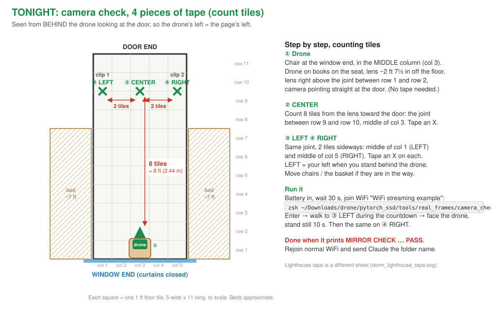
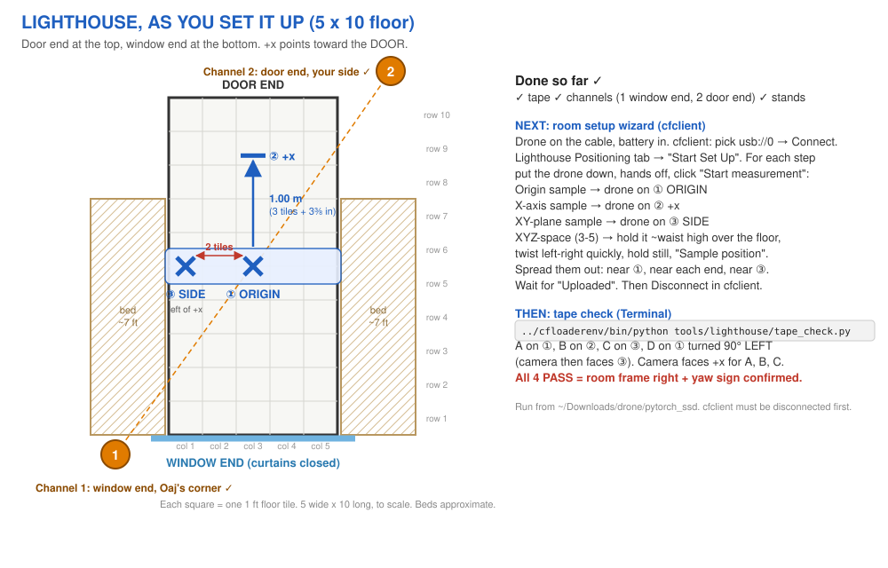

# Running the project from a dorm room

Written 2026-09-22, the day the micro-USB cable arrived. The Sep 20 plan
(`before_the_next_session.md`) assumed one drone, MinHyuk's lab and unknown
Lighthouse hardware. Now Sai has:

| item | status 2026-09-22 |
|---|---|
| Drone 1 (Crazyflie 2.x + AI-deck 1.1, streamer already flashed) | charging |
| Drone 2 | in hand. **Identical to drone 1** (confirmed by Sai 2026-09-22) |
| micro-USB cable | **one**, in hand. This clears the Sep 17 blocker |
| Two Lighthouse base stations | in hand, **V1 or V2 unknown** |
| Lighthouse **decks** (the boards that go on the drone) | **Lighthouse deck ("LH4") fitted on every drone, stacked with the AI-deck on the same drone** (confirmed by Sai 2026-09-22) |
| Crazyradio 2.0 + USB-A to USB-C adapter | dongle yes. **No adapter or hub yet (2026-09-22): the drone's micro-USB cable is also USB-A, so the laptop cannot reach the drone either.** Buy a USB-C hub with >= 2 USB-A data ports (drone cable + Crazyradio at once, needed for Session B). Charging does not need it: any USB-A wall charger works |
| Room | a small dorm room. Dimensions not yet measured |

The unknowns are what the first 20 minutes below are for.

*Update 2026-09-22 (evening):* Sai confirmed the deck question. Both drones are
identical, each carries an AI-deck **and** a Lighthouse deck on the same body,
and that stack is already assembled. So both drones can serve as either the
follower or the head beacon in Session B. Still unknown: base stations V1/V2
and the room (photos coming).

---

## 0. What the cable already unlocks, with no radio at all

The micro-USB cable is also a full data link. With a drone plugged into the
laptop, `cflib` connects at `usb://0`. The Crazyradio is not involved. That covers:

- reading which decks are fitted, the firmware version and battery state
  (`tools/hardware/preflight.py`, on branch `sai/hardware-preflight`, read-only:
  it never arms, never writes a parameter);
- the whole Lighthouse setup: setting it up in cfclient, estimating the room
  geometry, and reading the drone's position live;
- charging.

The radio only becomes necessary for a drone that is **not** on the cable. In
this plan that is the Session B beacon on someone's head, and later, flight.

---

## 1. Tonight, about 20 minutes, cable only

1. Plug drone 1 into the laptop with the battery connected. Charging and the
   data link come through the same cable.
2. Run the preflight tool. It reports the decks, firmware and battery, and if a
   Lighthouse deck is present, whether the base stations are being seen.
3. Swap to drone 2 and repeat. This is how we find out what drone 2 carries.
4. Take the photos in section 6.

Stop there. Don't join the deck's WiFi or open cfclient's flight tab yet.

---

## 2. Charging with one cable

- Both drones use the same BCB350 battery (350 mAh), and the batteries swap
  between drones. So one drone can act as the charger for both packs, one after
  the other. It takes about 40 minutes from flat.
- A 350 mAh pack gives **five to seven minutes** with the AI-deck streaming.
  Budget a session as "charged packs × 6 min". Two packs gives roughly 12
  minutes of camera time, which is enough for Session A's core set if the marks
  are taped out before anything is powered.
- **A second micro-USB cable costs about $5 and halves the charging time.** It
  must be a data cable, not charge-only. Buy one.
- Dorm safety: charge only while you are in the room, on a hard surface,
  never overnight. Unplug the battery for storage, because a LiPo left flat
  degrades.

---

## 3. The room: what each session needs in space

### Session A, real-people capture (needs WiFi only)

This is still the project's top open question: where real people's detection
margins sit. It needs no Lighthouse and no flight.

The protocol puts the subject at **1.5, 2.5 and 3.5 m** from the camera, at
0°, ±10° and ±25°. The geometry it needs:

| distance | lateral offset at ±25° | clear line needed from the camera |
|---|---|---|
| 1.5 m | 0.70 m each side | ~2.0 m |
| 2.5 m | 1.17 m each side | ~3.0 m |
| 3.5 m | 1.63 m each side | **~4.0 m**, plus ~3.3 m of width at the far end |

A typical double room is around 3.5 × 4.5 m before furniture. **The 3.5 m row
probably does not fit inside it**, and the room's diagonal is usually
cluttered. Options, best first:

1. Run 1.5 and 2.5 m in the room and 3.5 m in a hallway or study lounge.
   A hallway is also a plainer background, and a plain background is what
   the protocol wants.
2. Run the whole session in a lounge. It is one location and one lighting
   condition, which is cleaner.
3. Drop the 3.5 m row. This is the weakest option: the far distances are
   where the sim says margins are thinnest.

Wherever it runs:

- **Cover every mirror**, including the wardrobe-door mirror. A 20% mirrored
  floor in the simulator made the network read person plus reflection as one
  object. That is the Sep 12 size-head saga. A real mirror in shot is the same
  failure. It also hurts Lighthouse (see below).
- Close the blinds. Direct sun changes the camera's exposure and blinds the
  Lighthouse receivers.
- The subject is **a second person**. Sai runs the laptop. Ask a roommate or
  friend. More than one subject is better, because the question is about
  *people*, not about one person.

### Lighthouse (Session B prep and Session B)

From Bitcraze's Lighthouse guide:

- Mount the base stations **at least 50 cm above the working area**, in
  **two opposite corners**, angled down toward the middle of the room.
- Bitcraze quotes a working volume of about **4 × 4 × 2 m**. The drone must be
  within **6 m** of at least one station. A dorm room is inside that, so size
  is not the problem. Line of sight is.
- **No mirrors or shiny surfaces** in the volume, and no direct sunlight.
- Each station needs its **own wall power**. USB is only needed during setup.
  So "opposite corners" really means "opposite corners that each have an
  outlet or reach an extension cord".
- The stations have spinning parts. Mount them solidly: on top of a wardrobe
  or shelf, on a cheap light stand, or on a 1/4"-20 camera clamp. Don't mount
  them with tape. A station that wobbles gives a position that wobbles.
- **V2 stations** each need a unique channel (1 to 4), set in cfclient's base
  station tool with one station at a time plugged in over USB. **V1 stations**
  use a mode button on the back instead. Which one we have decides the steps.
  That is why a photo is needed.
- Geometry estimation, in cfclient over the USB cable: place the drone at the
  chosen origin, then 1 m along +x, then several spots on the floor, then hold
  it still in the air. The LED goes green when it is done. **Tape the origin
  and the +x mark on the floor and leave them there**, so the frame can be
  re-established on any later day.

### The actual room (from Sai's photos, 2026-09-22)

A long rectangle: door at one short wall, window and radiator at the other, a loft
bed with a desk underneath along each long wall, and an open aisle down the middle
(the rug). The aisle is the working volume. Photos are NOT committed (the repo is
public and they show a shared room).

Lighthouse placement decided:
- Two light stands with ball heads (already owned). **Diagonal corners, one at each
  end.** Final choice (Sai, 2026-09-22, by the outlets): station 1 at the door end by
  Sai's chair, station 2 at the window end on the roommate's side. Not side by side:
  two stations in one corner are occluded together.
- **Two sheets, one job each** (the first combined sketch mixed them and was
  confusing; replaced 2026-09-22). Both are drawn from behind the drone / door at
  the top, with every distance in feet and inches:
  - [`dorm_camera_check.svg`](dorm_camera_check.svg): tonight, green tape counted in
    floor tiles (1 ft each; the open floor is 5 x 11 tiles, measured by Sai): lens above
    the row 1/row 2 joint in the middle column, CENTER 8 tiles out (2.44 m), LEFT/RIGHT
    2 tiles either side (14 deg). `camera_check.sh` defaults match (2.44 m, 14 deg).
  - [`dorm_lighthouse_tape.svg`](dorm_lighthouse_tape.svg): Lighthouse night, three
    blue marks (ORIGIN on the row 5/6 line, mid col 3; +x 3 tiles + 3⅜ in toward the window;
    SIDE same line, mid col 5 = +y 0.61 m). Floor is 5 x 10 since 2026-09-24: station 1's
    stand took the door-end row, the station corners, and the evening's steps in order.
    Verification: `tools/lighthouse/tape_check.py` (read-only; A origin, B +x, C side,
    D origin turned 90 deg left = first real-hardware yaw-sign check).

- Stations **above the loft mattresses** (~2 m+), tilted 30-45 degrees down, aimed at
  the middle of the rug, ball heads locked. Check: stand mid-rug, both fronts visible.
- Suspected **mirror on the back of the door**: cover it. Blinds and curtain closed.
- Door-end station likely needs an extension cord, run along the wall.
- Origin: taped X mid-rug, +x mark exactly 1 m toward the window. Permanent.
- **Base stations are V2** (label: "SteamVR Base Station 2.0, Model 1004", seen
  2026-09-22 on one unit; the second looks identical, confirm its label). V2 steps,
  matching cfclient 2026.8 in `../cfloaderenv`:
  1. Channels, one station at a time: station powered + its micro-USB to the laptop
     via the hub, `~/Downloads/drone/cfloaderenv/bin/cfclient`, Lighthouse tab ->
     **Set BS channel** -> Scan base station -> set **1**; swap, set the other to **2**.
     Stored on the station; one-time.
  2. Mount on the stands (above), power only.
  3. Drone on the hub cable -> Lighthouse tab geometry wizard: origin X, 1 m mark,
     floor spots, held still in the air. Leave "Switch BS version" on V2.
  4. `preflight.py` for station visibility and position noise, then the taped-mark
     check.
- Session A: 1.5 m and 2.5 m fit along the aisle; the +-25 degree marks at 2.5 m need
  ~2.3 m of width, which the aisle may not have. 3.5 m goes in the hallway.

### Flight

**Nothing in this plan flies in the dorm.** Session A and Session B are both
capture sessions. For Session B, the follower drone can sit on a stand at a
taped pose while the beacon walks. Closed-loop following needs about 2 m of
standoff plus room to manoeuvre, a clear floor and a net or a lot of space.
That belongs in MinHyuk's lab, after Session A says whether the drone sees real
people at all. (In simulation it latched onto a median- or lower-detectability person in only
1 of 12 flights. Flying before that question is answered would mostly test
the frame, not the model.)

A short Lighthouse hover in a cleared corner could come later, to prove the
positioning. It is optional and does not come first.

---

## 4. A hardware conflict to check, not assume

*Update 2026-09-22 (evening):* the physical question is answered. Both decks are
stacked on both of Sai's drones today. What remains below is one narrow software
detail, and `preflight.py` checks it automatically on a stacked drone. Nothing needs
unstacking.

Can one drone carry both the AI-deck and a Lighthouse deck? The 2020 Bitcraze
forum answer was **no**: both used the Crazyflie's UART1. That answer is out of
date. In the current firmware:

- the AI-deck driver declares **UART2** plus IO_1 and IO_4
  (`crazyflie-firmware/src/deck/drivers/src/aideck.c`);
- the Lighthouse driver declares **UART1** and no GPIO (`lighthouse.c`).

Our follow packet goes GAP8 → ESP32 (SPI) → STM32 over CPX, which uses UART2.
It never touches UART1 (`crazyflie_ssd/src/transport_if.c`). So, at the level
of the deck drivers, there is **no conflict**. Bitcraze's stacking advice is:
Lighthouse deck on top, so the sensors see the sky; AI-deck between it and the
body, or underneath.

**The remaining doubt, unverified:** our GAP8 builds use `io=uart`
(`crazyflie_ssd/Makefile` line 4, and the stock `wifi-img-streamer` Makefile
line 1). On the AI-deck, the GAP8's UART is wired to the Crazyflie's UART1 pins,
which are the same lines the Lighthouse deck transmits on. If the GAP8 holds
its TX line driven, the Lighthouse data could be corrupted. How to test:
preflight on the stacked drone, then compare Lighthouse receive rate and
position noise with the GAP8 app running against the GAP8 held in reset. If it
bites, the fix is on our side: build the GAP8 app with `io=host` or route its
logs over CPX. No hardware change.

The Session B follower is the only drone that needs both decks. The beacon needs
only a Lighthouse deck. With a static follower, even the follower can skip the
Lighthouse deck: its pose is the taped mark.

---

## 4b. One drone, no hub, no internet: the camera check (added 2026-09-22)

Joining the deck's WiFi takes the laptop offline, so the check is one script that
runs unattended and prints the verdict:

    zsh ~/Downloads/drone/pytorch_ssd/tools/real_frames/camera_check.sh

Stream check (5 frames), then two 10 s mirror clips (drone's LEFT then
RIGHT; defaults 2.44 m / +-14 deg = 8 tiles out, 2 tiles sideways on the 5-tile-wide
floor, because +-25 deg lands under the lofts; `CAMERA_CHECK_DIST=2.5
CAMERA_CHECK_BEARING=25` restores the lab values) with a countdown so Sai can be the subject, then an offline chip
score and the MIRROR CHECK line. Frames go to `~/drone_frames/<date>/camera_check_*`
and are never committed. Rehearsed against `mock_streamer.py`
(`CAMERA_CHECK_GRAB_ARGS=--mock`): plumbing OK end to end; the mock served one
position for both clips and the scorer correctly said FAIL "NOT a mirror".

## 5. Session order

| # | session | needs | where | answers |
|---|---|---|---|---|
| 0 | inventory (section 1) | cable | desk | what we actually have |
| A | real-people capture (`first_hour_with_the_drone.md`, `camera_measurement_protocol.md`) | charged packs, WiFi, a second person, tape measure | dorm + hallway/lounge | **where real detection margins sit**, the top open question |
| B0 | Lighthouse install + geometry + static taped-mark check (`before_the_next_session.md` §3.5) | Lighthouse deck(s), stations mounted, cable | dorm | is Lighthouse truth correct to the tape measure? |
| B | two-drone ground truth | 2 Lighthouse decks, radio + adapter, distinct radio addresses, head mount for the beacon | dorm or lounge | labels for frames the network misses |
| F | flight | MinHyuk's lab | lab | closed loop on hardware |

**Session A does not wait for anything in B.** That is the Sep 20 sequencing
rule, and it still holds.

---

## 6. Photos that decide the next steps

1. **The room.** One photo from each of two opposite corners. Also the rough
   dimensions (a tape measure, or count floor tiles or paces), where the
   outlets are, and any mirrors or windows.
2. **The Lighthouse base stations.** Front, back and any label, plus
   everything that came in the box (power adapters, mounts). This tells V1
   from V2.
3. ~~Drone 2 from above~~ (not needed: both drones identical, AI-deck +
   Lighthouse deck each, confirmed 2026-09-22). A photo of the Lighthouse
   decks is still welcome.
4. **The Crazyradio** and whatever USB-C adapter or hub is around.

## Lighthouse geometry: take floor samples on a book, not the tile (added 2026-09-24)

The dorm floor is glossy vinyl. With the drone flat on it, the origin and SIDE samples
were about 79 mm off, and the frame came out displaced by more than a metre. A sample
held over the origin read x 1.29. Retaking the three floor samples with the drone on the
same book each time gave errors of 0.3-2.0 mm, and SIDE read exactly 0.61 m. *Update
11:12: the tape check then passed 4/4 with the drone on the bare floor, which weakens the
reflection idea. The leading suspect is now XYZ samples bunched at one end of the room
(the redo also spread them out).* *Update 11:18: book vs bare floor gave identical
tape-check results, so floor reflection is ruled out. The book is unnecessary; spreading
the XYZ samples from the origin outward is the rule.* Full log: `docs/eval_results/2026-09-24-lighthouse-dorm-setup/`.

Procedure: same matte book under the drone for origin, +x and SIDE. First XYZ sample
over the origin must read about (0, 0). Spread XYZ samples over both halves of the room.
Every row should be under 15 mm. Do not move the stands after setup.
