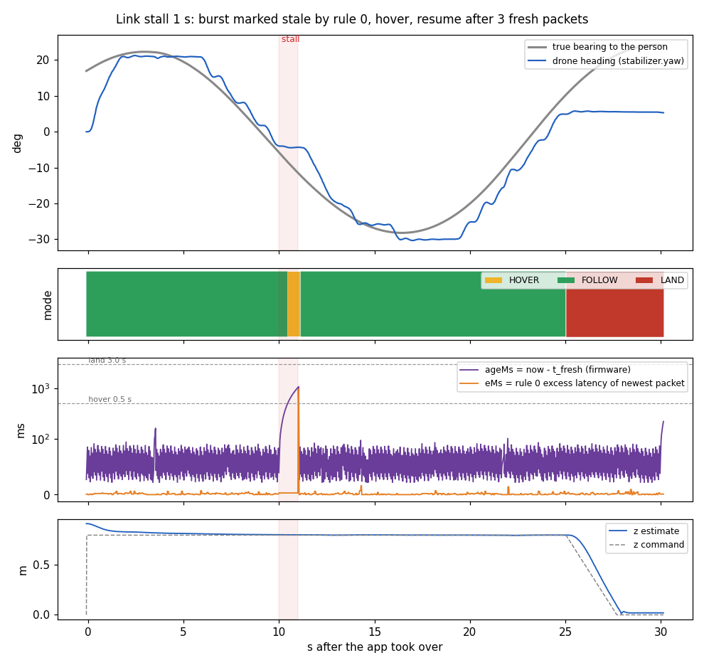
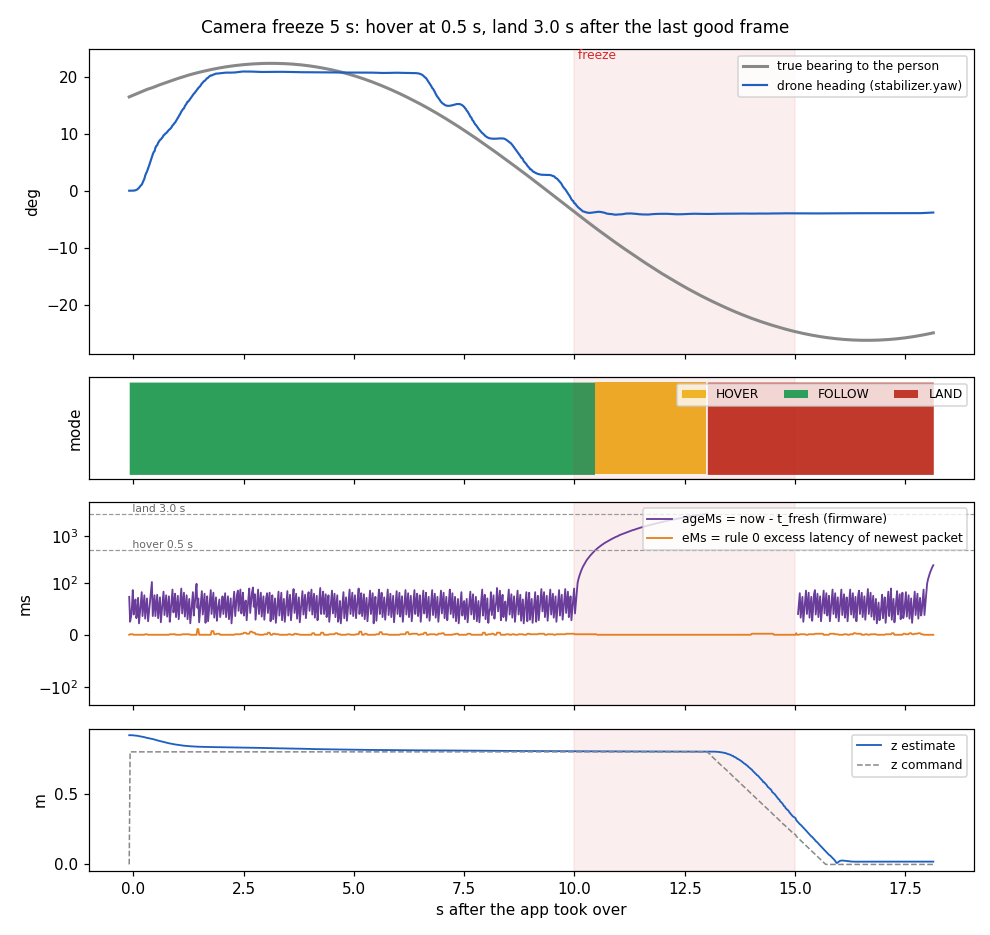

# Follow app: the STM32 controller as a Crazyflie out-of-tree app (part 2)

`src/follow_app.c` wraps the portable controller (`../follow_controller.c`, part 1) in a
Crazyflie out-of-tree app, laid out like the firmware's `examples/app_appchannel_test`
and `examples/app_stm_gap8_cpx`. It is compiled into CrazySim's SITL firmware and flown
there. **It has not been built for or flown on a real Crazyflie**; the hardware section
below is how to do that, checked only against the firmware sources.

| file | what |
|---|---|
| `src/follow_app.c` | the app: packet intake from two sources, 100 Hz control task, commander setpoints, landing, params and logs |
| `src/follow_controller_unit.c` | compiles `../../follow_controller.c` into the app (one source for the firmware and the host tests) |
| `Kbuild`, `src/Kbuild`, `Makefile`, `app-config` | out-of-tree build for the real Crazyflie (`CONFIG_APP_ENABLE=y`, priority 1, stack 500 words) |
| `../sim/Dockerfile.sitl`, `../sim/sitl_follow_app.cmake`, `../sim/build_image.sh` | builds the image `crazysim-mac:follow-app`: CrazySim's SITL `cf2` with the app compiled in (the base image `crazysim-mac:arm64` is not modified) |
| `../sim/run_sim_follow_app.sh` | starts CrazySim with that firmware; headless by default (works with a locked screen), `--viewer` for the 3D window |
| `../../crazysim_macos/gap8_emulator.py` | stands in for the AI-deck: camera frames -> model -> GAP8 decoder -> v6 packets over the CRTP app channel; takes off, enables the app, logs, injects faults |
| `../../crazysim_macos/analyze_follow_app.py`, `plot_follow_app.py` | score a flight (modes, yaw convention, heading error, freeze/stall timings) and chart it |
| `../sim/fly_app.sh` | one flight on a fresh headless sim with the truth log, emulator, firmware console, and shutdown |
| `../sim/results/` | the Sep 11 flights: `summary.json`, `analysis.json`, firmware console, charts |

## What the app does

- **Two packet sources, one function.** `followAppOnPacket(data, len, src)` feeds every
  28-byte v6 packet to `follow_ctl_on_packet` with the arrival time `usecTimestamp()`:
  - CPX function `CPX_F_APP` from the GAP8 (`cpxRegisterAppMessageHandler`), compiled only
    when `CONFIG_ENABLE_CPX` is set and the platform is not SITL (real hardware);
  - the CRTP App Channel (`appchannelReceiveDataPacket` in its own task), used by the
    simulator; the 28-byte packet fits the 31-byte MTU. cflib: `cf.appchannel.send_packet(data)`.

  `followapp.srcMask` picks the sources (bit 0 app channel, bit 1 CPX, default 3).
  Interleaving two streams would upset rule 0 (a `frame_id` going backwards resets its
  window), so fly with one: 2 (CPX only) with the AI deck.
- **Control task at 100 Hz** (`vTaskDelayUntil`, 10 ms): `follow_ctl_arm` while waiting to
  arm, `follow_ctl_step` every step. HOVER/FOLLOW become a setpoint of body-frame velocity
  `vx`, yaw rate, and absolute height (`modeVelocity` x/y with `velocity_body`,
  `modeAbs` z, `modeVelocity` yaw: the same setpoint the CRTP hover packet produces).
- **Commander priority `COMMANDER_PRIORITY_EXTRX` (3)**, above CRTP (2) and the high-level
  commander (1). A client still streaming setpoints cannot fight the app while it flies.
  Ways out for the operator: `followapp.enable = 0` (the app lands), or the supervisor's
  emergency stop (`cf.supervisor.send_emergency_stop()` in cflib), which does not depend
  on setpoint priority. After landing the app sends motor-stop setpoints for 1 s, then
  relaxes the priority. It also relaxes it when `followapp.reset` cuts that 1 s short: this
  firmware's commander never lowers the priority on its own, so a forgotten relax would leave
  the host's CRTP setpoints ignored.
- **Idle until enabled.** It sends nothing while `followapp.enable = 0`, so the host takes off
  first (in the simulator: hover setpoints to 0.8 m). When `enable` goes 0 -> 1 it arms once the
  estimated height is at least `followapp.armMinZ` (0.3 m) and the controller allows it (rule 0
  warm-up done, the link not slower than its floor, and by default a valid frame at most 0.5 s
  old), then takes over, ramping to the 0.8 m hold height if it starts lower. With the drone on
  the ground it waits (`armErr` 20) instead of taking off by itself. `armMinZ = 0` allows enabling
  on the ground, which means an **autonomous take-off to 0.8 m and a hover even without a
  confirmed target** (HANDOFF allows take-off after the warm-up; the app does not by default).
- **Lands on its own** when the controller says LAND (rule 1: newest valid frame older than
  3 s, or age 255): it descends at 0.3 m/s from the current height, stops the motors at
  touchdown (estimated z < 5 cm, or 1 s after the ramp reaches 0), and stays down until
  `followapp.reset`. Clearing `enable` in flight lands the same way (`landRsn` 2). Every landing
  clears `followapp.enable`, and after a reset the app needs a fresh 0 -> 1 write of `enable`
  (a leftover 1 at the reset gives `armErr` 21), so a reset alone can never re-arm it.
- **Clock reads under the mutex.** Both the packet path and the control step read
  `usecTimestamp()` after taking the controller mutex, so a step can never see a `t_fresh` in its
  future (before safety review 7 a preemption in between could latch a spurious LAND).

App states (`followapp.state`): 0 IDLE, 1 WAIT_ARM, 2 ACTIVE, 3 LANDING, 4 DONE.

| param `followapp.*` | type | default | meaning |
|---|---|---|---|
| `enable` | u8 | 0 | 0 -> 1 = arm and fly on the controller's output; 0 while flying = land; cleared by the app when it lands |
| `reset` | u8 | 0 | write 1 to re-initialize the controller (only when not flying); applies `yawSign`, `armFresh`; wait for `state` 0, then write `enable` 0 -> 1 |
| `armMinZ` | float | 0.3 | arm only at or above this estimated height (m); 0 = also from the ground (autonomous take-off) |
| `yawSign` | i8 | -1 | controller yaw sign (see below) |
| `armFresh` | u8 | 1 | take-off gate also needs a fresh frame (1) or only the warm-up (0) |
| `srcMask` | u8 | 3 | packet sources: bit 0 app channel, bit 1 CPX |

| log `followapp.*` | type | meaning |
|---|---|---|
| `state`, `mode`, `reason` | u8 | app state; controller mode (0 WAIT_WARMUP, 1 HOVER, 2 FOLLOW, 3 LAND); `follow_reason_t` |
| `yawRate`, `vx`, `zCmd` | float | commanded yaw rate (deg/s, + = counter-clockwise), forward velocity (m/s), height (m) |
| `ageMs` | u16 | now - t_fresh in ms (65535 = none) |
| `eMs` | float | rule 0 excess latency of the newest accepted packet (ms) |
| `riseMs` | float | newest accepted packet's latency above the rule 0 latency floor (ms; stale above 100) |
| `reconf` | u8 | rule 4 re-confirmation count |
| `armErr`, `landRsn`, `lastRx` | u8 | last `follow_ctl_arm` result (255 = not tried, 3 warm-up, 4 no fresh frame, 5 late packet, 6 link slower than its floor), or the app's own 20 (below `armMinZ`) / 21 (enable must go 0 -> 1); 1 controller / 2 operator landing; last `follow_rx_status_t` |
| `rxApp`, `rxCpx`, `rxIgn`, `rxRej`, `rxStale` | u16 | packets per source, ignored by `srcMask`, rejected, stale by rule 0 (warm-up included) |

### Yaw sign (verified in CrazySim)

`setpoint_t.attitudeRate.yaw > 0` turns the drone counter-clockwise seen from above
(`stabilizer.yaw` increases). The person right of the image center (`x_center > 0`) needs a
clockwise turn, so `yawSign = -1`. Measured in the static-offset flight: the person was 15.9°
right of the nose when the app took over; the app commanded -26.7 deg/s and the yaw went from
0° to -18° (the person's bearing is -16°); the measured yaw rate had the commanded sign in
61 of 61 samples. CrazySim runs the firmware's own commander and PID controller, so this
convention carries over to hardware, but the camera mirror (`x_center` is left to right *of
the network image*, HANDOFF step 5.5) still has to be checked on the real deck.

## Simulator (CrazySim on this Mac)

```sh
cd tools/stm32_follow_app
./sim/build_image.sh              # crazysim-mac:follow-app, ~5 s (reuses the base image's build)
./sim/run_sim_follow_app.sh --camera --scene "$PWD/../crazysim_macos/scenes/moving/scene_person.xml"
# other terminal:
cd ../crazysim_macos
../../../trainenv/bin/python gap8_emulator.py --duration 40 --out ../../../demo/follow_app_runs/moving
../../../trainenv/bin/python analyze_follow_app.py ../../../demo/follow_app_runs/moving --truth truth.csv
```
Or one command per flight: `sim/fly_app.sh <name> <scene> <duration> [emulator flags]` (fresh
headless sim, truth log, firmware console saved; `FLY_LOCK=<dir>` serializes with other sim users).

The SITL build is CMake, not Kbuild, so `sim/sitl_follow_app.cmake` adds the app layer
(`app_handler.c`, which starts `appMain` in its own task; `system.c` calls `appInit()` when
`CONFIG_APP_ENABLE` is defined) and the two app sources to the `cf2` target, and defines
`CONFIG_APP_ENABLE=1`, `CONFIG_APP_PRIORITY=1`, `CONFIG_APP_STACKSIZE=2048`. SITL has no CPX,
so only the app-channel source is compiled there. The firmware locks after every landing, so
each flight needs a fresh sim (the launcher starts a fresh container every time). Set
`CRAZYSIM_TRUTH_LOG=<csv>` before launching to log the person's true position.

**What `gap8_emulator.py` reproduces** (details in its docstring): the GAP8 decoder
(`tools/firmware_decode/follow_decode.c`, ported and checked against the C by
`gap8_emulator.py --selftest`: 200,000 frames, 0 differences), packet v6 with bits 0/1, the frame
age in 20 ms units at the transfer and `gap8_tx_ms`, no-target packets on every 0.5 s capture
timeout, the GAP8's own re-confirmation after 0.4 s gaps, and serial newest-frame processing.
Fault options: `--freeze-at/--freeze-for` (camera), `--stall-at/--stall-for` (link holds, then
bursts), `--delay-at/--delay-for/--delay-ms`, `--drop-at/--drop-for`, all in seconds after the app
took over. Not reproduced: NINA/SPI waits and CPX TX drops on the GAP8.

**Clocks in the simulator.** The GAP8 clock is the Mac's monotonic clock plus a random 32-bit
offset. The firmware clock is SITL's FreeRTOS tick (1 kHz from a wall-clock timer that loses
ticks under load; `usecTimestamp()` has 1 ms resolution there). Rule 0 flags only packets later
than the window's fastest delivery, so a firmware clock that runs slow shrinks `e`; a held
packet still shows up as late (a 1 s hold measured as ~1000 ms).

## Results in CrazySim (Sep 11, 2026)

Eight flights, each on a fresh headless sim with the follow-app firmware, the person's true
position logged, and `gap8_emulator.py` as the AI deck (every new camera frame, ~14.9 Hz,
unless noted). The host only took off and set `followapp.enable`; all steering, hovering and
landing came from the app. Faults start 10 s after the app took over. Delays are measured on
the host from the last good frame's arrival to the app log sample (the log adds up to ~20 ms);
`ageMs` is the firmware's own `now - t_fresh`. Every flight: 0 rejected packets, sim/wall
0.994-0.997, and about 31 packets stale by rule 0 during the 2 s warm-up on the ground (expected).

| flight | result |
|---|---|
| **static_offset**: person 3.5 m out, 1 m right; 30 s | **Turned toward the person** (yaw sign check): heading error -15.9° at take-over, 1.7° 5 s later; then 1.1° mean, 1.8° max (host follower: 1.1° mean). Closed from 3.64 to 2.19 m (host: 2.3 m). FOLLOW 100% of the time |
| **moving**: person swaying ±1.2 m / 20 s; 40 s | **True heading error 2.7° mean, 5.3° p90, 8.1° max** (host follower `follow_person.py`: 2.7° mean, 7.7° max). FOLLOW 100%, 724/724 packets delivered |
| moving at chip speed: `--rate-hz 6.5 --infer-ms 153`; 40 s | 2.8° mean, 5.6° p90, 8.0° max (host follower at chip speed: 3.1° mean, 7.9° max); 6.45 Hz achieved, 154-157 ms between frames |
| **empty room**; 20 s | **Never moved**: 0 FOLLOW samples, yaw-rate and vx commands 0 throughout, drift 0.00 m. The GAP8 never set bit 0 (3 isolated frames reached p >= 0.7, peak 0.74) |
| **camera freeze 1.5 s** | **Hover 0.487 s** after the last good frame (`ageMs` 502); the GAP8 sent 3 no-target packets 0.50 s apart. After the freeze the GAP8 set bit 0 on the 3rd fresh frame, and the app **resumed FOLLOW on the 5th** (its 3rd packet with bits 0+1), 0.37 s after the freeze; no steering before that |
| **camera freeze 5 s** | **Hover 0.488 s** (`ageMs` 501), **LAND 3.03 s after the last good frame** (rule 1; `ageMs` 2998 on the last sample before). Latched: the camera came back at 5 s, mid-descent, and the app kept landing (z 0.02 m after) |
| **link stall 1 s** (link holds, then bursts) | **Hover 0.502 s** after the last on-time packet (rule 2). The burst of 15 held packets arrived at once: **14 stale by rule 0** (`eMs` up to 967); the one built 25 ms before the burst was fresh. Resumed 0.13 s after the burst on its 3rd fresh bits-0+1 packet; no steering from the stall until then |
| link delay 1 s (`--delay-for 1 --delay-ms 1000`, FIFO) | 29 packets late, **28 stale by rule 0** (`eMs` up to 986); hover 0.50 s after the last on-time packet; resumed 0.08 s after the last late packet on 3 fresh packets; no landing (the gap stayed under 3 s) |

Per-flight `summary.json`, analyzer output (`analysis.json`), firmware console and charts:
`../sim/results/<flight>/`. Raw logs (app log at 50 Hz, every packet, truth CSVs, ~5 MB):
`drone/demo/follow_app_sim_2026-09-11/` next to the repo. Re-fly one:
`../sim/fly_app.sh stall1 moving 25 --stall-at 10 --stall-for 1` (fresh headless sim, truth
logged), then `analyze_follow_app.py` and `plot_follow_app.py` on its output.





## Building for the real Crazyflie (not tested on hardware)

Nothing below has been run: no ARM toolchain is installed on this Mac, and no Crazyflie has
flown this app. The API names were checked against the crazyflie-firmware inside CrazySim
(`git describe`: v1.2-alpha-24-gaa6571dc, a fork of bitcraze/crazyflie-firmware), and the app
sources compile with no warnings under `-Wall -Wextra -Werror -Wdouble-promotion -Wshadow`
against its headers (host gcc, SITL configuration). The hardware build adds `-Os -Werror`
and the CPX path, which SITL does not compile.

1. **Firmware checkout and toolchain.** A crazyflie-firmware that has
   `cpxRegisterAppMessageHandler` (`src/modules/interface/cpx/cpx.h`) and
   `appchannelReceiveDataPacket` (`src/modules/interface/app_channel.h`), cloned with
   `--recursive`, plus `arm-none-eabi-gcc` and `make` (Bitcraze's building-and-flashing guide
   lists the packages).
2. **GAP8 side.** Build the AI-deck firmware with `APP_ENABLE_CPX_APP_PACKET_TX=1` (off by
   default; HANDOFF.md section 3), or the STM32 receives no follow packets.
3. **Build the app** (keep `app/` inside `tools/stm32_follow_app/`: the sources include
   `../../follow_controller.c` and `.h` by relative path):
   ```sh
   cd tools/stm32_follow_app/app
   make CRAZYFLIE_BASE=/path/to/crazyflie-firmware        # -> build/cf2.bin
   ```
   `app-config` turns on `CONFIG_APP_ENABLE` (task priority 1, stack 500 words = 2 KB; the
   firmware default is 300). CPX needs `CONFIG_ENABLE_CPX`, which `CONFIG_DECK_AI` selects and
   which defaults to `y`; without it the app compiles with the app-channel source only (the boot
   message then says "app channel only").
4. **Flash**: `make CRAZYFLIE_BASE=/path/to/crazyflie-firmware cload` with a Crazyradio (put the
   Crazyflie in bootloader mode first), or `cfloader flash build/cf2.bin stm32-fw`. Check the
   console for `FOLLOW: follow app up: CPX + app channel, waiting for followapp.enable`.
5. **Fly** (Flow deck or another position source is required: the app commands body-frame
   velocity and absolute height, like cflib's MotionCommander):
   - connect with cflib; set `followapp.srcMask = 2` (CPX only);
   - log `followapp.state`, `mode`, `reason`, `ageMs`, `eMs`, `rxCpx`, `rxRej`, `rxStale`; with the
     deck streaming, `rxCpx` must climb at the frame rate and `rxRej` stay 0;
   - take off to 0.8 m (hover setpoints or MotionCommander), then set `followapp.enable = 1`;
     the app takes over when `state` becomes 2; stop sending setpoints then (they are ignored
     at priority 2 anyway, but after the app lands and relaxes the priority, a client still
     streaming hover setpoints would take off again);
   - land with `followapp.enable = 0`; emergency: `cf.supervisor.send_emergency_stop()`.
6. **Check first, tethered or with props off where possible:**
   - camera mirror: a person on the right of the camera must give `x_center > 0`
     (HANDOFF step 5.5), and the drone must then turn clockwise (`yawRate < 0`);
   - `eMs` and `riseMs` stay at a few ms in steady state (rule 0), and the healthy latency
     `L_min` is measured on the bench (HANDOFF section 3). **Bench-check it before every enable**:
     the latency floor only catches a link that got slower *after* the GAP8 and STM32 booted;
     one that was slow from boot sets the floor itself;
   - covering the camera: hover after 0.5 s, land 3 s after the last valid frame;
   - the stack high-water mark of the app task (`followRx` and the app task) under load.

Differences from the simulator to keep in mind: CPX packets arrive in the CPX router task
(the callback takes the controller mutex briefly), `usecTimestamp()` has microsecond
resolution and the two clocks differ by crystal drift only (<= ~200 ppm), and the real link
latency is unmeasured.
