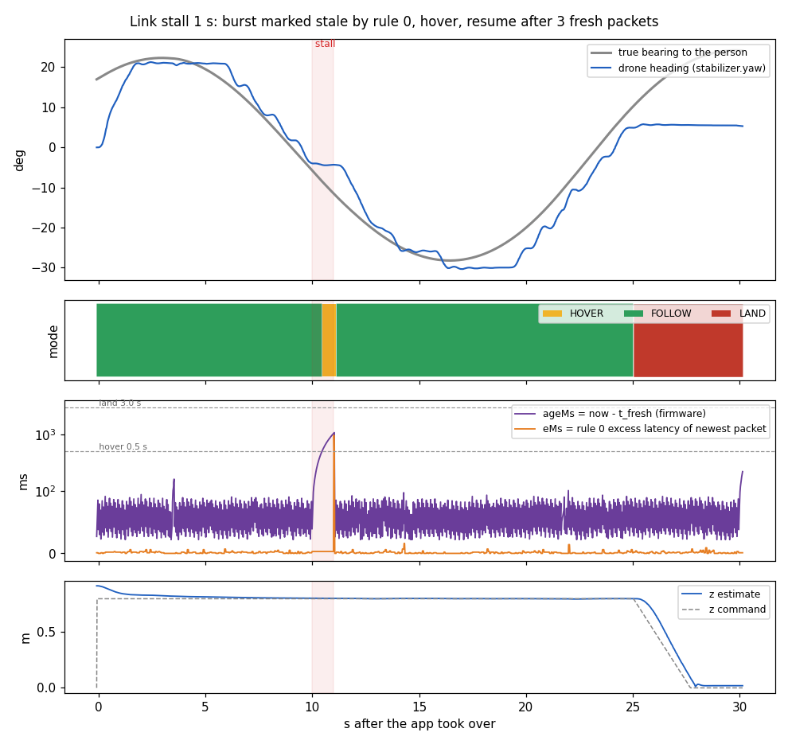
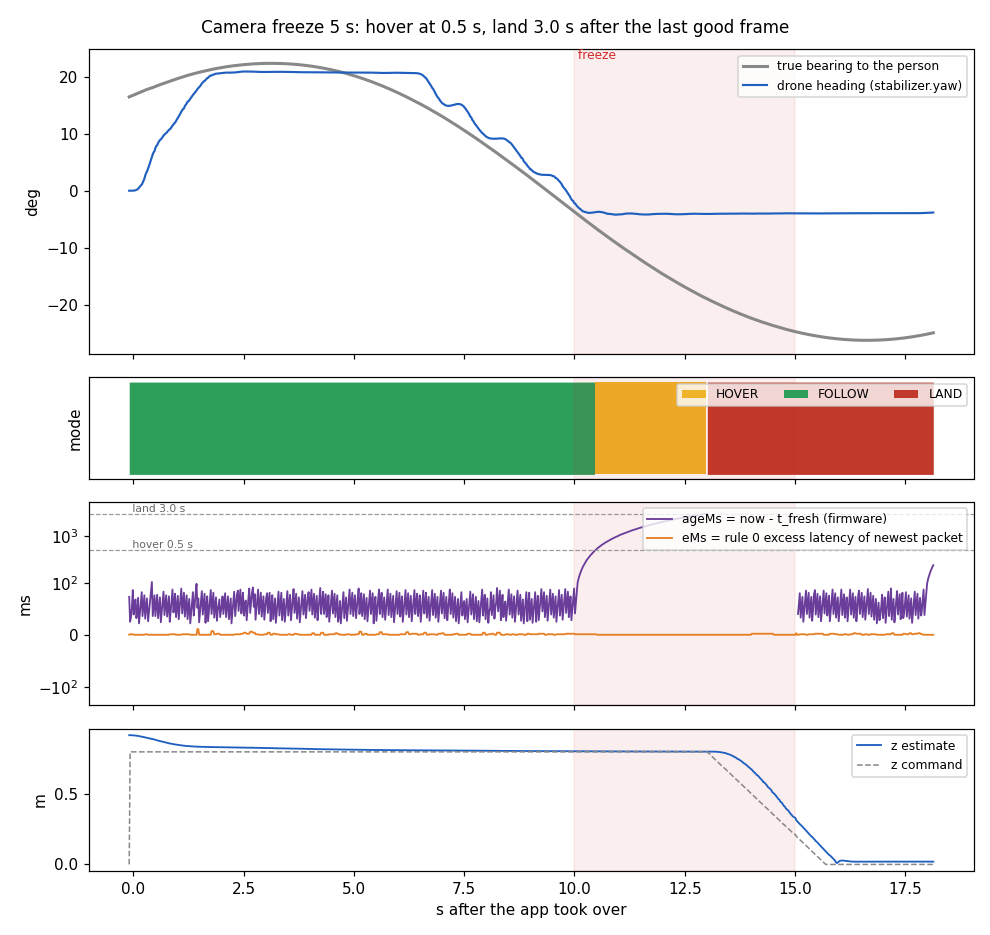

# Follow app: the STM32 controller as a Crazyflie out-of-tree app (part 2)

`src/follow_app.c` wraps the portable controller (`../follow_controller.c`, part 1) in a
Crazyflie out-of-tree app, laid out like the firmware's `examples/app_appchannel_test`
and `examples/app_stm_gap8_cpx`. It is compiled into CrazySim's SITL firmware and flown
there. **It has not been built for or flown on a real Crazyflie**; "Building for the real
drone" below is how to do that, checked only against the firmware sources, and "Staged first
flights" is the order to fly it in (dry run, hover, yaw only, fenced follow) with
`tools/hardware/kill_switch.py`.

| file | what |
|---|---|
| `src/follow_app.c` | the app: packet intake from two sources, 100 Hz control task, commander setpoints, landing, params and logs |
| `src/follow_controller_unit.c` | compiles `../../follow_controller.c` into the app (one source for the firmware and the host tests) |
| `Kbuild`, `src/Kbuild`, `Makefile`, `app-config` | out-of-tree build for the real Crazyflie (`CONFIG_APP_ENABLE=y`, priority 1, stack 500 words) |
| `../sim/Dockerfile.sitl`, `../sim/sitl_follow_app.cmake`, `../sim/build_image.sh` | builds the image `crazysim-mac:follow-app`: CrazySim's SITL `cf2` with the app compiled in (the base image `crazysim-mac:arm64` is not modified) |
| `../sim/run_sim_follow_app.sh` | starts CrazySim with that firmware; headless by default (works with a locked screen), `--viewer` for the 3D window |
| `../../crazysim_macos/gap8_emulator.py` | stands in for the AI-deck: camera frames -> model -> GAP8 decoder -> v6 packets over the CRTP app channel; takes off, enables the app, logs, injects faults |
| `../../crazysim_macos/analyze_follow_app.py`, `plot_follow_app.py` | score a flight (modes, yaw convention, heading error, freeze/stall timings) and chart it |
| `../sim/fly_app.sh` | one flight on a fresh headless sim with the truth log, emulator, firmware console, and shutdown |
| `../sim/results/` | the Sep 11 flights: `summary.json`, `analysis.json`, firmware console, charts |
| `../sim/flight_modes_summary.py` | scores flights flown with the safety modes (drift from the arming point, heading error, fence landing) |
| `../../hardware/kill_switch.py` | the kill switch: SPACE / ENTER / Ctrl-C = emergency stop, plus a dead-man watchdog (section "Kill switch") |
| `../../../docs/sim_results/2026-10-01-flight-modes/` | the safety modes and the kill switch in CrazySim |

## What the app does

- **Two packet sources, one function.** `followAppOnPacket(data, len, src)` feeds every
  28-byte v6 packet to `follow_ctl_on_packet` with the arrival time `usecTimestamp()`:
  - CPX function `CPX_F_APP` from the GAP8 (`cpxRegisterAppMessageHandler`), compiled only
    when `CONFIG_ENABLE_CPX` is set and the platform is not SITL (real hardware);
  - the CRTP App Channel (`appchannelReceiveDataPacket` in its own task), used by the
    simulator; the 28-byte packet fits the MTU (31 bytes in the SITL firmware, 30 in 2026.08). cflib: `cf.appchannel.send_packet(data)`.

  `followapp.srcMask` picks the sources (bit 0 app channel, bit 1 CPX, default 3).
  Interleaving two streams would upset rule 0 (a `frame_id` going backwards resets its
  window), so fly with one: 2 (CPX only) with the AI deck.
- **Control task at 100 Hz** (`vTaskDelayUntil`, 10 ms): `follow_ctl_arm` while waiting to
  arm, `follow_ctl_step` every step. HOVER/FOLLOW become a setpoint of body-frame velocity
  `vx`, yaw rate, and absolute height (in `yawOnly`: a position hold, below) (`modeVelocity` x/y with `velocity_body`,
  `modeAbs` z, `modeVelocity` yaw: the same setpoint the CRTP hover packet produces).
- **Commander priority `COMMANDER_PRIORITY_EXTRX` (3)**, above CRTP (2) and the high-level
  commander (1). A client still streaming setpoints cannot fight the app while it flies.
  Ways out for the operator: `followapp.enable = 0` (the app lands), or the supervisor's
  emergency stop (`cf.supervisor.send_emergency_stop()` in cflib), which does not depend
  on setpoint priority. After landing the app sends motor-stop setpoints for 1 s, then
  relaxes the priority. It also relaxes it when `followapp.reset` cuts that 1 s short: this
  firmware's commander never lowers the priority on its own, so a forgotten relax would leave
  the host's CRTP setpoints ignored.
- **Idle until enabled.** It sends nothing while `followapp.enable = 0`, so the host takes off
  first (in the simulator: hover setpoints to 0.8 m). When `enable` goes 0 -> 1 it arms once the
  estimated height is at least `followapp.armMinZ` (0.3 m) and the controller allows it (rule 0
  warm-up done, the link not slower than its floor, and by default a valid frame at most 0.5 s
  old), then takes over, ramping to the 0.8 m hold height if it starts lower. With the drone on
  the ground it waits (`armErr` 20) instead of taking off by itself. `armMinZ = 0` allows enabling
  on the ground, which means an **autonomous take-off to 0.8 m and a hover even without a
  confirmed target** (HANDOFF allows take-off after the warm-up; the app does not by default).
- **Lands on its own** when the controller says LAND (rule 1: newest valid frame older than
  3 s, or age 255): it descends at 0.3 m/s from the current height, stops the motors at
  touchdown (estimated z < 5 cm, or 1 s after the ramp reaches 0), and stays down until
  `followapp.reset`. Clearing `enable` in flight lands the same way (`landRsn` 2). Every landing
  clears `followapp.enable`, and after a reset the app needs a fresh 0 -> 1 write of `enable`
  (a leftover 1 at the reset gives `armErr` 21), so a reset alone can never re-arm it.
- **First-flight safety modes** (parameters below; all three are copied when the app arms and
  hold for that flight, so a parameter write in flight cannot switch the commander off under a
  flying drone or move the fence; they take effect at the next arm):
  - `dryRun = 1`: everything runs (arming, the controller, the fence, landing, DONE) and every
    setpoint is built and logged (`wYaw`, `wVx`, `spKind`), but **the commander is never called**:
    no motion, no motor-stop setpoint, no priority taken. `nSp` (setpoints sent) stays 0. For
    props-off, hand-held checks, or with the host flying the drone.
  - `yawOnly = 1`: on the arming step the app latches `stateEstimate.x/y` (`armX`, `armY`) and the
    hold height, and from then on sends a position-hold setpoint at that point with only the yaw
    rate from the network: `mode.x/y/z = modeAbs` (`setpoint_t.position`, world frame) and
    `mode.yaw = modeVelocity` (`attitudeRate.yaw`). Those fields are the same in
    `stabilizer_types.h` of crazyflie-firmware 2026.08 (`setpoint_mode_t`) and of the SITL
    firmware; the PID position controller (`position_controller_pid.c`) runs a position loop on
    each `modeAbs` axis and `controller_pid.c` integrates `attitudeRate.yaw` when the yaw mode
    is `modeVelocity`. The network's forward speed is not used (`wVx` = 0).
  - Geofence, **on by default** (`fenceOn = 1`, the one default that changes behaviour): a box of
    +-`fenceX` x +-`fenceY` (1.0 m) around the arming point and `z <= fenceZ` (1.2 m). Outside
    it the app runs its normal landing (`landRsn` 3). It also needs a **valid position estimate**:
    the Kalman filter is the estimator, `stateEstimate.x/y/z` and `kalman.varX/varY` are finite,
    and `max(varX, varY) <= posVarMax` (0.01 m^2, 10 cm std). Without Lighthouse (or any absolute
    source) the Kalman x/y variance grows every prediction step, so a lost or stale source shows
    up there. An invalid estimate lands too (`landRsn` 4); `yawOnly` alone (fence off) also lands
    on it, because its hold point means nothing without x/y. The landing itself is the existing
    one (zero body velocity, height ramped down) and uses no x/y.
  - Arming is refused, and the host keeps control, when these modes cannot work: `armErr` 22 (no
    valid position estimate; `fence` says why), 23 (z above `fenceZ`, or the 0.8 m hold height not
    below it), 24 (a fence number or `posVarMax` is not a positive finite number).
  - `posVarMax` is **not calibrated for Lighthouse**: in CrazySim the in-flight variance is
    1e-6 m^2 and an estimator with no absolute position sits at 100 m^2. Read `posVar` during the
    M4 dry run (below) before trusting it.
- **Clock reads under the mutex.** Both the packet path and the control step read
  `usecTimestamp()` after taking the controller mutex, so a step can never see a `t_fresh` in its
  future (before safety review 7 a preemption in between could latch a spurious LAND).

App states (`followapp.state`): 0 IDLE, 1 WAIT_ARM, 2 ACTIVE, 3 LANDING, 4 DONE.

| param `followapp.*` | type | default | meaning |
|---|---|---|---|
| `enable` | u8 | 0 | 0 -> 1 = arm and fly on the controller's output; 0 while flying = land; cleared by the app when it lands |
| `reset` | u8 | 0 | write 1 to re-initialize the controller (only when not flying); applies `yawSign`, `armFresh`; wait for `state` 0, then write `enable` 0 -> 1 |
| `armMinZ` | float | 0.3 | arm only at or above this estimated height (m); 0 = also from the ground (autonomous take-off) |
| `yawSign` | i8 | -1 | controller yaw sign (see below) |
| `armFresh` | u8 | 1 | take-off gate also needs a fresh frame (1) or only the warm-up (0) |
| `srcMask` | u8 | 3 | packet sources: bit 0 app channel, bit 1 CPX |
| `dryRun` | u8 | 0 | 1 = build and log every setpoint, never call the commander (latched at arming) |
| `yawOnly` | u8 | 0 | 1 = hold the arming point's x/y and the hold height, yaw rate from the network only (latched) |
| `fenceOn` | u8 | **1** | geofence and position-validity check (latched); 0 = the behaviour before 2026-10-01 |
| `fenceX`, `fenceY` | float | 1.0 | fence half-widths around the arming point (m) |
| `fenceZ` | float | 1.2 | fence ceiling, estimated height (m); must be above the 0.8 m hold height |
| `posVarMax` | float | 0.01 | largest `kalman.varX`/`varY` (m^2) counted as a valid position; uncalibrated (M4) |

| log `followapp.*` | type | meaning |
|---|---|---|
| `state`, `mode`, `reason` | u8 | app state; controller mode (0 WAIT_WARMUP, 1 HOVER, 2 FOLLOW, 3 LAND); `follow_reason_t` |
| `yawRate`, `vx`, `zCmd` | float | yaw rate (deg/s, + = counter-clockwise) and forward velocity (m/s) of the setpoint sent this step (0 when nothing was sent, as in a dry run), and the height command (m) |
| `ageMs` | u16 | now - t_fresh in ms (65535 = none) |
| `eMs` | float | rule 0 excess latency of the newest accepted packet (ms) |
| `riseMs` | float | newest accepted packet's latency above the rule 0 latency floor (ms; stale above 100) |
| `reconf` | u8 | rule 4 re-confirmation count |
| `armErr`, `landRsn`, `lastRx` | u8 | last `follow_ctl_arm` result (255 = not tried, 3 warm-up, 4 no fresh frame, 5 late packet, 6 link slower than its floor), or the app's own 20 (below `armMinZ`) / 21 (enable must go 0 -> 1) / 22 (no valid position) / 23 (fence ceiling) / 24 (bad fence numbers); landing reason 1 controller / 2 operator / 3 geofence / 4 position estimate invalid; last `follow_rx_status_t` |
| `wYaw`, `wVx` | float | the setpoint built this step (deg/s, m/s), sent or not; in a dry run `yawRate`/`vx` stay 0 and these carry the would-be values |
| `spKind` | u8 | setpoint built this step: 0 none, 1 velocity (follow), 2 position hold (yawOnly), 3 landing, 4 motor stop |
| `nSp` | u32 | setpoints actually sent to the commander since boot (0 for a whole dry run) |
| `modes` | u8 | this flight's latched modes: bit 0 dryRun, bit 1 yawOnly, bit 2 fence |
| `fence`, `fenceHit` | u8 | position/fence status now: 0 ok, 1 outside x/y, 2 above `fenceZ`, 3 no Kalman estimate, 4 non-finite, 5 variance above `posVarMax`; and the status that caused a landing |
| `posVar` | float | max(`kalman.varX`, `kalman.varY`) (m^2) |
| `armX`, `armY` | float | the arming point (fence centre, yawOnly hold point) |
| `rxApp`, `rxCpx`, `rxIgn`, `rxRej`, `rxStale` | u16 | packets per source, ignored by `srcMask`, rejected, stale by rule 0 (warm-up included) |

### Yaw sign (verified in CrazySim)

`setpoint_t.attitudeRate.yaw > 0` turns the drone counter-clockwise seen from above
(`stabilizer.yaw` increases). The person right of the image center (`x_center > 0`) needs a
clockwise turn, so `yawSign = -1`. Measured in the static-offset flight: the person was 15.9°
right of the nose when the app took over; the app commanded -26.7 deg/s and the yaw went from
0° to -18° (the person's bearing is -16°); the measured yaw rate had the commanded sign in
61 of 61 samples. CrazySim runs the firmware's own commander and PID controller, so this
convention carries over to hardware, but the camera mirror (`x_center` is left to right *of
the network image*, HANDOFF step 5.5) still has to be checked on the real deck.

## Simulator (CrazySim on this Mac)

```sh
cd tools/stm32_follow_app
./sim/build_image.sh              # crazysim-mac:follow-app, ~5 s (reuses the base image's build)
./sim/run_sim_follow_app.sh --camera --scene "$PWD/../crazysim_macos/scenes/moving/scene_person.xml"
# other terminal:
cd ../crazysim_macos
../../../trainenv/bin/python gap8_emulator.py --duration 40 --out ../../../demo/follow_app_runs/moving
../../../trainenv/bin/python analyze_follow_app.py ../../../demo/follow_app_runs/moving --truth truth.csv
```
Or one command per flight: `sim/fly_app.sh <name> <scene> <duration> [emulator flags]` (fresh
headless sim, truth log, firmware console saved; `FLY_LOCK=<dir>` serializes with other sim users).
`gap8_emulator.py --app-param NAME=VALUE` writes `followapp.NAME` before take-off (e.g.
`--app-param yawOnly=1`). To fly beside another simulator, set `CRAZYSIM_CONTAINER`,
`CRAZYSIM_PORT` (cflib URI = port - 100) and `CRAZYSIM_CAM_PORT`; `CRAZYSIM_EXTRA` adds
`crazysim.py` flags (`--sensor-noise --turbulence light`, `--flowdeck`); `FOLLOW_APP_IMAGE`
picks the image (the 2026-10-01 runs used `crazysim-mac:follow-app-safety`, built from this
branch; `crazysim-mac:follow-app` is the older app without the safety modes).

**The fence is on by default since 2026-10-01**, so the Sep 11 flights below cannot be reproduced
as they were: `static_offset` closed 1.45 m on the person, which now lands at the 1.0 m fence
(that is the `fence` flight in `docs/sim_results/2026-10-01-flight-modes/`). Add
`--app-param fenceOn=0` to re-fly the old profiles.

The SITL build is CMake, not Kbuild, so `sim/sitl_follow_app.cmake` adds the app layer
(`app_handler.c`, which starts `appMain` in its own task; `system.c` calls `appInit()` when
`CONFIG_APP_ENABLE` is defined) and the two app sources to the `cf2` target, and defines
`CONFIG_APP_ENABLE=1`, `CONFIG_APP_PRIORITY=1`, `CONFIG_APP_STACKSIZE=2048`. SITL has no CPX,
so only the app-channel source is compiled there. The firmware locks after every landing, so
each flight needs a fresh sim (the launcher starts a fresh container every time). Set
`CRAZYSIM_TRUTH_LOG=<csv>` before launching to log the person's true position.

**What `gap8_emulator.py` reproduces** (details in its docstring): the GAP8 decoder
(`tools/firmware_decode/follow_decode.c`, ported and checked against the C by
`gap8_emulator.py --selftest`: 200,000 frames, 0 differences), packet v6 with bits 0/1, the frame
age in 20 ms units at the transfer and `gap8_tx_ms`, no-target packets on every 0.5 s capture
timeout, the GAP8's own re-confirmation after 0.4 s gaps, and serial newest-frame processing.
Fault options: `--freeze-at/--freeze-for` (camera), `--stall-at/--stall-for` (link holds, then
bursts), `--delay-at/--delay-for/--delay-ms`, `--drop-at/--drop-for`, all in seconds after the app
took over. Not reproduced: NINA/SPI waits and CPX TX drops on the GAP8.

**Clocks in the simulator.** The GAP8 clock is the Mac's monotonic clock plus a random 32-bit
offset. The firmware clock is SITL's FreeRTOS tick (1 kHz from a wall-clock timer that loses
ticks under load; `usecTimestamp()` has 1 ms resolution there). Rule 0 flags only packets later
than the window's fastest delivery, so a firmware clock that runs slow shrinks `e`; a held
packet still shows up as late (a 1 s hold measured as ~1000 ms).

## Results in CrazySim (Sep 11, 2026)

The safety modes and the kill switch (2026-10-01) have their own results:
`docs/sim_results/2026-10-01-flight-modes/README.md` (yawOnly drift 0.045 m mean / 0.123 m max
under light turbulence, heading error 1.2 deg; fence landing at 1.0 m with 0.06 m overshoot; no
take-over without an absolute position; kill switch: motors 0 in 22 ms after SPACE, 1.008 s after
the last watchdog ping when the pings stop).

**Bar note (2026-09-13).** These flights used the GAP8 emulator at the bar of the time,
`{4216, -998, 3}` (enter p >= 0.70). The team then moved the enter bar to p >= 0.75
(`{5467, -998, 3}` for the champion; `docs/firmware_contract.md`, change note). Nothing
below has been re-flown at 0.75; the "p >= 0.7" in the empty-room row is the bar that
flight ran at, not the current one.

Eight flights, each on a fresh headless sim with the follow-app firmware, the person's true
position logged, and `gap8_emulator.py` as the AI deck (every new camera frame, ~14.9 Hz,
unless noted). The host only took off and set `followapp.enable`; all steering, hovering and
landing came from the app. Faults start 10 s after the app took over. Delays are measured on
the host from the last good frame's arrival to the app log sample (the log adds up to ~20 ms);
`ageMs` is the firmware's own `now - t_fresh`. Every flight: 0 rejected packets, sim/wall
0.994-0.997, and about 31 packets stale by rule 0 during the 2 s warm-up on the ground (expected).

| flight | result |
|---|---|
| **static_offset**: person 3.5 m out, 1 m right; 30 s | **Turned toward the person** (yaw sign check): heading error -15.9° at take-over, 1.7° 5 s later; then 1.1° mean, 1.8° max (host follower: 1.1° mean). Closed from 3.64 to 2.19 m (host: 2.3 m). FOLLOW 100% of the time |
| **moving**: person swaying ±1.2 m / 20 s; 40 s | **True heading error 2.7° mean, 5.3° p90, 8.1° max** (host follower `follow_person.py`: 2.7° mean, 7.7° max). FOLLOW 100%, 724/724 packets delivered |
| moving at chip speed: `--rate-hz 6.5 --infer-ms 153`; 40 s | 2.8° mean, 5.6° p90, 8.0° max (host follower at chip speed: 3.1° mean, 7.9° max); 6.45 Hz achieved, 154-157 ms between frames |
| **empty room**; 20 s | **Never moved**: 0 FOLLOW samples, yaw-rate and vx commands 0 throughout, drift 0.00 m. The GAP8 never set bit 0 (3 isolated frames reached p >= 0.7, peak 0.74) |
| **camera freeze 1.5 s** | **Hover 0.487 s** after the last good frame (`ageMs` 502); the GAP8 sent 3 no-target packets 0.50 s apart. After the freeze the GAP8 set bit 0 on the 3rd fresh frame, and the app **resumed FOLLOW on the 5th** (its 3rd packet with bits 0+1), 0.37 s after the freeze; no steering before that |
| **camera freeze 5 s** | **Hover 0.488 s** (`ageMs` 501), **LAND 3.03 s after the last good frame** (rule 1; `ageMs` 2998 on the last sample before). Latched: the camera came back at 5 s, mid-descent, and the app kept landing (z 0.02 m after) |
| **link stall 1 s** (link holds, then bursts) | **Hover 0.502 s** after the last on-time packet (rule 2). The burst of 15 held packets arrived at once: **14 stale by rule 0** (`eMs` up to 967); the one built 25 ms before the burst was fresh. Resumed 0.13 s after the burst on its 3rd fresh bits-0+1 packet; no steering from the stall until then |
| link delay 1 s (`--delay-for 1 --delay-ms 1000`, FIFO) | 29 packets late, **28 stale by rule 0** (`eMs` up to 986); hover 0.50 s after the last on-time packet; resumed 0.08 s after the last late packet on 3 fresh packets; no landing (the gap stayed under 3 s) |

Per-flight `summary.json`, analyzer output (`analysis.json`), firmware console and charts:
`../sim/results/<flight>/`. Raw logs (app log at 50 Hz, every packet, truth CSVs, ~5 MB):
`drone/demo/follow_app_sim_2026-09-11/` next to the repo. Re-fly one:
`../sim/fly_app.sh stall1 moving 25 --stall-at 10 --stall-for 1` (fresh headless sim, truth
logged), then `analyze_follow_app.py` and `plot_follow_app.py` on its output.





## Building for the real drone (UNTESTED)

**Nothing in this section has been run.** No ARM toolchain is installed on this Mac (on purpose:
nothing system-wide), no `cf2.bin` has been built from this app, and no Crazyflie has flown it.
What was checked, on 2026-10-01: the drone's firmware is **crazyflie-firmware 2026.08, git
`54f31e243a0b`** (preflight, `docs/eval_results/2026-09-24-lighthouse-dorm-setup/README.md`),
which is exactly the `2026.08` tag on github.com/bitcraze/crazyflie-firmware. Against a shallow
clone of that tag, the app and the controller pass `clang --target=arm-none-eabi -mcpu=cortex-m4
-mfloat-abi=hard -fsyntax-only -Os -Wall -Wextra -Wshadow -Wdouble-promotion -Werror` with the
firmware's include paths, CPX on, and a hand-written `autoconf.h` (`CONFIG_ESTIMATOR_KALMAN_ENABLE`
on and off). That is a header/API check, not a build: no gcc, no Kconfig, no link. It found one
real problem, fixed here (`StateEstimatorTypeKalman` only exists with
`CONFIG_ESTIMATOR_KALMAN_ENABLE`), and the SITL gcc build found another (a helper named like a
GCC built-in, which `-Werror` would have failed on). In 2026.08, `APPCHANNEL_MTU` is 30 (the SITL
firmware has 31); the 28-byte packet fits both.

**What is needed** (from the 2026.08 sources):

- the firmware source at the drone's release, cloned with submodules (FreeRTOS, CMSIS, ...);
- `arm-none-eabi-gcc` **10.3 or newer** (Bitcraze's policy in `docs/building-and-flashing/build.md`:
  the oldest supported is Ubuntu 22.04's `gcc-arm-none-eabi`, GCC 10.3); `make`, `python3`, `git`,
  and for Kconfig a host C compiler with `flex` and `bison`;
- Bitcraze builds apps in CI with the Docker image **`bitcraze/builder`** (tag `41` = `latest`,
  pushed 2026-08-11, digest `sha256:42b8363f7560...`, **amd64 only**, about 7.0 GB compressed). Its
  Dockerfile (github.com/bitcraze/docker-builder, `src/Dockerfile`) is `buildpack-deps:22.04` plus
  apt's `gcc-arm-none-eabi`, i.e. GCC 10.3. CI runs `./tools/build/make_app <app dir>` in it;
- alternatives Bitcraze documents: `brew install gcc-arm-embedded coreutils gnu-sed` (system-wide,
  not done here), or the firmware's own `pixi.toml` (`xpack-gcc-arm-none-eabi` 13.3.1, osx-arm64,
  a project-local environment, but pixi itself must be installed first).

**Exact commands** (option A is Bitcraze's own image; option B is lighter, native arm64, and uses
the `ubuntu:22.04` image already on this Mac, so the same GCC 10.3 package; both untested):

```sh
# 1. The drone's firmware release, with submodules (path without spaces)
git clone --recursive --branch 2026.08 https://github.com/bitcraze/crazyflie-firmware.git \
    ~/Downloads/drone/crazyflie-firmware-2026.08
git -C ~/Downloads/drone/crazyflie-firmware-2026.08 rev-parse --short=12 HEAD   # must print 54f31e243a0b

# 2A. Build in Bitcraze's CI image (amd64: emulated on Apple Silicon, slow; ~7 GB pull)
docker run --rm --platform linux/amd64 \
    -v ~/Downloads/drone/crazyflie-firmware-2026.08:/module \
    -v ~/Downloads/drone/pytorch_ssd:/repo \
    bitcraze/builder:41 \
    bash -c "cd /repo/tools/stm32_follow_app/app && make CRAZYFLIE_BASE=/module -j8"

# 2B. Or in plain Ubuntu 22.04 (arm64 here), installing the toolchain inside the throwaway container
docker run --rm \
    -v ~/Downloads/drone/crazyflie-firmware-2026.08:/module \
    -v ~/Downloads/drone/pytorch_ssd:/repo \
    ubuntu:22.04 bash -c "apt-get update && DEBIAN_FRONTEND=noninteractive apt-get install -y \
        --no-install-recommends gcc-arm-none-eabi libnewlib-arm-none-eabi binutils-arm-none-eabi \
        build-essential flex bison python3 git ca-certificates \
      && git config --global --add safe.directory '*' \
      && arm-none-eabi-gcc --version | head -1 \
      && cd /repo/tools/stm32_follow_app/app && make CRAZYFLIE_BASE=/module -j8"

# Either way the image is tools/stm32_follow_app/app/build/cf2.bin (build/ is gitignored).
# The build is the whole firmware (2026.08) plus this app; app-config turns on CONFIG_APP_ENABLE
# (priority 1, stack 500 words). CPX needs CONFIG_ENABLE_CPX, which CONFIG_DECK_AI selects and which
# defaults to y; check the boot console says "CPX + app channel".

# 3. Flash over the radio (the drone on, Crazyradio in). This REPLACES the stock 2026.08 STM32
#    firmware; to go back, flash Bitcraze's 2026.08 release the same way (or with cfclient).
~/Downloads/drone/cfloaderenv/bin/python -m cfloader flash \
    tools/stm32_follow_app/app/build/cf2.bin stm32-fw -w radio://0/80/2M/E7E7E7E709

# 4. Check: preflight must now show a modified firmware and the followapp parameter group
~/Downloads/drone/cfloaderenv/bin/python tools/hardware/preflight.py
```

`make ... cload` in the app directory would also flash, but it runs `python3 -m cfloader` inside
whatever environment runs make; use the cfloaderenv command above on the Mac.

**GAP8 side.** Build the AI-deck firmware with `APP_ENABLE_CPX_APP_PACKET_TX=1` (off by default;
`docs/firmware_integration/HANDOFF.md` section 3), or the STM32 receives no follow packets. Fly
with `followapp.srcMask = 2` (CPX only), so a stray app-channel packet cannot interleave.

Differences from the simulator to keep in mind: CPX packets arrive in the CPX router task
(the callback takes the controller mutex briefly), `usecTimestamp()` has microsecond
resolution and the two clocks differ by crystal drift only (<= ~200 ppm), the real link
latency is unmeasured, and the real position estimate is noisier than CrazySim's perfect pose.

## Staged first flights (M4 -> M7)

From the expert review: never fly the whole thing at once. Each stage has to pass before the
next. **Current rule: nothing flies in the dorm.** M4 does not fly (props off, `dryRun = 1`), so
it can be done wherever the drone may be powered. **M5 and later fly, and need a place approved
for flying** (not the dorm), with its own Lighthouse set-up and geometry (the dorm file
`docs/hardware/lighthouse/dorm_lighthouse_2026-09-24.yaml` is for the dorm only), a clear area of
at least 3 x 3 m around the take-off point, one person whose only job is the kill switch, and
nobody else inside the fence.

Every stage starts the same way: fresh battery, `tools/hardware/preflight.py` all OK with
`lighthouse.status` 2 (working), the follow-app firmware confirmed (boot console line
`follow app up: CPX + app channel`), the GAP8 streaming (`rxCpx` climbing at the frame rate,
`rxRej` 0), and `followapp.srcMask = 2`. Log at least `followapp.state, mode, reason, armErr,
landRsn, modes, nSp, spKind, wYaw, wVx, fence, fenceHit, posVar, armX, armY, ageMs` and
`stateEstimate.x/y/z`, `stabilizer.yaw`. Write each stage's numbers into `EXPERIMENTS.md`.
Still open from the earlier hardware list, and needed before M6: `eMs` and `riseMs` stay at a few
ms in steady state (rule 0), and the healthy link latency `L_min` is measured on the bench
(HANDOFF section 3); bench-check it before every enable, because the latency floor only catches a
link that got slower after the GAP8 and STM32 booted. Also read the stack high-water mark of the
app task and `FOLLOWRX` under load.

| stage | what | params (`followapp.*`) | pass criterion |
|---|---|---|---|
| **M4** dry run, hand-held, **props OFF** | hold the drone at about 0.8 m (waist height: above `armMinZ` 0.3 m, below the 1.2 m ceiling, or it will not arm), camera toward the person; `enable` 0 -> 1 | `dryRun=1`, defaults otherwise (`fenceOn=1`, `yawOnly=0`, `armMinZ=0.3`) | `state` 2 and `modes` 5 (dryRun + fence); **`nSp` stays 0 the whole time** and the motors never move; person right of the camera -> `wYaw < 0`, left -> `wYaw > 0` (this is also the camera-mirror check, HANDOFF step 5.5); `wVx > 0` when the person is far, 0 or negative when close; carried > 1.0 m from the arming point in x, then in y, then lifted above 1.2 m -> `state` 3 with `landRsn` 3 and `fenceHit` 1 / 1 / 2 (`reset`, then `enable` 0 -> 1 between tries) |
| M4, `posVarMax` calibration | same set-up; hold still, move it around inside the 1 m box, then block the Lighthouse deck's sensors (hand over the deck) for 5 s | as above | write down `posVar` while tracking (expected far below 0.01 m^2) and how long after blocking it passes `posVarMax` (`landRsn` 4, `fenceHit` 5). If it never passes, or passes while tracking is fine, change `posVarMax` and log the decision in `DECISIONS.md`. This is the Lighthouse-loss detection time; the simulator could not measure it |
| M4, kill switch rehearsal | close cfclient (one program per radio), start `kill_switch.py`, press SPACE | none | the banner, pings counting up, SPACE -> "supervisor reports LOCKED"; power-cycle the drone after |
| **M5** Lighthouse hover | the host takes off to 0.5-0.8 m with position/hover setpoints, hovers 30 s, lands; the follow app is not enabled. Once, from a hover at <= 0.3 m over a soft surface, the kill-switch person presses SPACE | `enable=0` | horizontal drift <= 0.10 m from the take-off point, z within +-0.05 m, `posVar` stays below `posVarMax`; the SPACE test drops the drone at once and `supervisor.info` shows LOCKED |
| **M6** yaw-only follow | host take-off to 0.8 m, then `enable=1`; the person stands 2-3 m in front, then steps 1 m left and right and back; land with `enable=0` | `yawOnly=1`, `fenceOn=1`, `fenceX=fenceY=1.0`, `fenceZ=1.2`, `posVarMax` from M4, `dryRun=0` | `state` 2, `modes` 6, `spKind` 2 throughout, `wVx` 0; it turns toward the person every time (heading error under 10 deg within 2 s of the person stopping, sign never reversed); drift from `armX/armY` <= 0.15 m, z 0.8 +- 0.1 m; covering the camera gives HOVER after 0.5 s and LAND 3 s after the last valid frame; no landing other than the ones asked for |
| **M7** fenced follow | as M6, then the person walks slowly toward and away from the drone; at the end the person walks out of the fence on purpose | `yawOnly=0`, `fenceOn=1`, `fenceX=fenceY=1.0` (or tighter), `fenceZ=1.2` | it follows forward and back at <= 0.3 m/s and stays inside the box; walking away makes it land at the fence with `landRsn` 3, `fenceHit` 1 and an overshoot <= 0.15 m (CrazySim: 0.06 m); the kill switch is not needed |

**Before M5** something has to run the take-off and the kill switch together: one Crazyradio
serves one program, and the kill switch has to be the program that owns the link (or live inside
the one that does). The repo has no hardware flight-host script yet; it should create its
`Crazyflie`, then `ks = KillSwitch(CflibKillLink.attach(cf)); ks.arm()` and call `ks.tick()` from
a thread every 20 ms, and route SPACE/ENTER/Ctrl-C to `ks.on_key()` / `ks.on_interrupt()` (that is
what `tools/hardware/kill_switch_sim_check.py` does in CrazySim). For M6/M7 the host only takes
off, writes the parameters, sets `enable`, and watches; the app does the rest. The host must stop
streaming setpoints once `state` is 2: they are ignored at CRTP priority 2 while the app flies,
but after the app lands and relaxes the priority, a client still streaming hover setpoints would
take off again.

## Kill switch

`tools/hardware/kill_switch.py` (cfloaderenv: cflib 0.1.33):

```sh
~/Downloads/drone/cfloaderenv/bin/python tools/hardware/kill_switch.py                       # radio://0/80/2M/E7E7E7E709
~/Downloads/drone/cfloaderenv/bin/python tools/hardware/kill_switch.py --uri usb://0
~/Downloads/drone/cfloaderenv/bin/python tools/hardware/kill_switch.py --uri udp://127.0.0.1:19850   # CrazySim
```

- **SPACE, ENTER or Ctrl-C = emergency stop** (`cf.supervisor.send_emergency_stop()`, sent 5 times
  20 ms apart). Closing the terminal (SIGHUP), SIGTERM, an error in the tool and a lost radio
  link (cflib `connection_lost`) also send it. **The motors stop at once and the drone falls; it
  does not land.** It stays locked until power-cycled. Other keys do nothing; `q` quits only
  after a stop.
- **Dead-man watchdog.** While running it sends `cf.supervisor.send_emergency_stop_watchdog()`
  every 0.1 s. After the first one, the firmware stops the motors by itself when 1.0 s passes
  without one (`DEFAULT_EMERGENCY_STOP_WATCHDOG_TIMEOUT`, supervisor.c, same in 2026.08 and the
  SITL firmware): the tool crashing, being killed, the laptop sleeping or the link dropping all
  stop the drone within about a second. So once it has started, quitting it locks the drone too.
- The screen is redrawn in its own thread and XON/XOFF is off, so a frozen terminal or a stray
  Ctrl-S cannot hold up SPACE. Exit code 0 = stop sent and `supervisor.info` reported LOCKED,
  1 = sent but not confirmed, 2 = never started (nothing was armed).
- Firmware 2026.08 reports CRTP protocol 12, so cflib sends the supervisor-port commands;
  CrazySim's SITL reports protocol 7 and gets cflib's legacy localization-port packets.
  **Only the legacy path has been exercised** (CrazySim, `docs/sim_results/2026-10-01-flight-modes/`).
- Tests: `tools/hardware/test_kill_switch.py` (fake link, no cflib needed) and
  `tools/hardware/kill_switch_sim_check.py` (CrazySim: the CLI in a pseudo-terminal, SIGKILL
  dead-man, and in flight).
